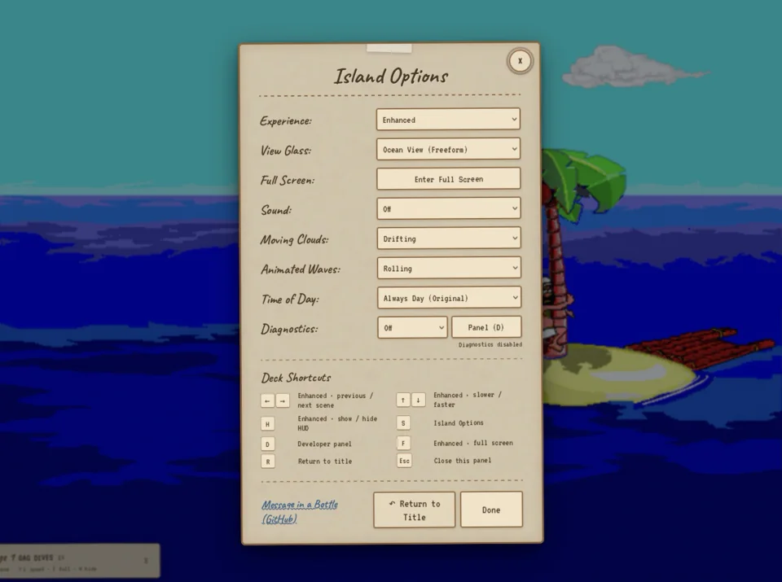
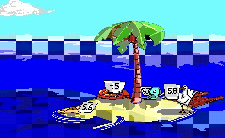

# johnny_web

A web-native reimplementation of the 1992 [Johnny Castaway](https://en.wikipedia.org/wiki/Johnny_Castaway) screensaver, powered by **Bottle DGDS**: an experimental runtime, inspection, and conformance toolkit for DGDS animations.

**tl;dr**

- Run `pnpm install` and `pnpm run dev` to get started.
- You must supply the original screensaver data files to run the project.
- This is a hard fork of [xesf/castaway](https://github.com/xesf/castaway) modernized for ES modules and Vite.

## How to play

The screensaver requires three proprietary data files that are not included in this repository. These files originate from the original 1992/1993 Windows 3.1 floppy distribution by Sierra On-Line.

If you are just looking to run the screensaver on an already-hosted version of this site, simply download the Windows 3.1 floppy image ZIP from the [Internet Archive](https://archive.org/details/screen-antics-johnny-castaway-16-color-v1.01-int.-1.4.93-win3.1-1.44m). Once downloaded, drag and drop the ZIP file (or the unzipped `.ima` file) into the browser window. The app will automatically unpack the data securely in your browser and run the game offline.

## Developer setup

Requirements: Node.js 24+ and pnpm 10. 

```bash
pnpm install
pnpm run dev       # http://localhost:5173
```

When you first open the local dev server, you will be prompted to drag and drop the downloaded ZIP or IMA file into the window to extract the required data as described above. Alternatively, a CLI extraction script (`pnpm run extract`) is provided for headless environments.

> [!TIP]
> **Testing the empty state locally**
> If you have already extracted the files locally but want to test the first-run drag-and-drop experience, run `pnpm run dev:empty`. This starts Vite without local assets and automatically opens `http://localhost:5173/?reset` to clear the local browser cache and force the empty state.

## Command reference

| Command                       | Description                                                                                             |
| ----------------------------- | ------------------------------------------------------------------------------------------------------- |
| `pnpm run dev`                | Start Vite dev server at http://localhost:5173                                                          |
| `pnpm run dev:empty`          | Start Vite without local assets to test the first-run drag-and-drop experience                          |
| `pnpm run build`              | Production build to `dist/`                                                                             |
| `pnpm run preview`            | Serve the `dist/` build locally                                                                         |
| `pnpm run extract -- "<zip>"` | Extract screensaver data from Archive.org ZIP (CLI alternative)                                         |
| `pnpm test`                   | Run the Vitest test suite                                                                               |
| `pnpm run test:watch`         | Run Vitest in watch mode while developing                                                               |
| `pnpm run test:coverage`      | Run the Vitest suite with V8 coverage                                                                   |
| `pnpm run test:golden`        | Replay known rendering sequences against committed logical/pixel fingerprints (requires extracted data) |
| `pnpm run test:golden:update` | Regenerate rendering fingerprints after reviewing an intentional change (requires extracted data)       |
| `pnpm run dump`               | Dump screensaver assets to `dumps/` for inspection (requires extracted data)                            |

## Playback modes

The opening screen leaves the original Sierra artwork unobstructed and offers:

- **Classic** — native scale, static clouds and waves, and faithful defaults.
- **Enhanced** — responsive scaling, moving clouds and waves, plus a small HUD.

In Enhanced mode, use `←`/`→` to change scenes, `↑`/`↓` to change speed, and `F` to enter or leave full screen. Dismiss the status note with its close button; press `H` to hide or restore it. Every option remains individually adjustable in Settings.

During playback, move the pointer to reveal the Settings cog. Press `S` for Settings at any time, or `R` to stop playback and return to the title screen.

## Screenshots

<p align="center">
  
  <br>
  <sub>Enhanced presentation controls remain separate from the faithful DGDS runtime.</sub>
</p>

<p align="center">
  
  <br>
  <sub>The original 16-color artwork rendered by Bottle DGDS.</sub>
</p>

## Diagnostics

Choose **Settings** on the opening screen, or press `S` at any time. Sound can be turned on or off there, and the choice persists across reloads.

Set Diagnostics to **On**. This starts a fresh structured trace from the current engine tick and enables the concise console log. Press `D` to open the developer panel; opening it also enables diagnostics.

| URL              | Output                                          |
| ---------------- | ----------------------------------------------- |
| `?debug`         | Diagnostics on at page load                     |
| `?debug=verbose` | Same trace plus noisy per-sprite console output |

The developer panel's **Download JSONL trace** button downloads the capture. Its first record identifies the build, browser, display, and engine state. Later records include lifecycle, drawing, timing-map, layer, pixel-fingerprint, and audio-sample events.

Headless tools can read `window.__DGDS__.getTrace()`, download with `saveTrace()`, or write under `traces/` through the Vite-only `persistTrace()` endpoint. Old diagnostics URLs remain compatible aliases.

## Documentation

- [Architecture](docs/architecture.md) — current execution model, repository map, host boundaries, and known compatibility gaps
- [Resource index](docs/resindex.md) — file formats and reverse-engineering notes
- [Contributing](CONTRIBUTING.md) — verification and change guidelines

## Engine roadmap

Bottle DGDS currently means the reusable DGDS codecs and machine, base package contract, and browser-presentation host under `src/dgds/` and `src/bottle/`. Johnny's manifest and UI live separately under `src/games/johnny/`.

The next portability milestone is to replay an independently sourced, non-interactive DGDS presentation by adding a package without changing the faithful machine. A complete DGDS game would additionally require interaction, dialogue, inventory, save-state, and title-native systems. These exercises should shape the API before it is treated as stable; Bottle does not claim drop-in compatibility today.

## Related projects and references

- [ScummVM DGDS engine](https://github.com/scummvm/scummvm/tree/master/engines/dgds) — the most complete open implementation and an important behavioral reference.
- [ScummVM DGDS detection table](https://github.com/scummvm/scummvm/blob/master/engines/dgds/detection_tables.h) — known DGDS releases, demos, platforms, and resource fingerprints.
- [xesf/castaway](https://github.com/xesf/castaway) — the project from which this repository was originally forked.
- [DGDS resource index](docs/resindex.md) — this project's current format findings.

## Acknowledgements

**A Personal Note**
I remember in the early 90s going to the office with one of my parents and seeing this running on a machine as a screensaver. I thought it was really cool! For decades you basically didn't see it anymore, and it's super cool that I can now just have it running in a browser tab for a bit of fun. It was a really fun way to learn more about how these old screensavers worked.

AI was used in building this project, and it made doing all the reverse engineering and testing vastly easier than a traditional way of hand-scaling it. I managed to complete this effort over a few intense sessions—what probably would have taken me several weeks of detailed reverse engineering and testing otherwise.

That being said, while AI was a great help, none of this would have been possible without the hard work that a lot of people put in. A huge thanks to the folks who did all the basic reverse engineering, the people who preserved and uploaded the files to the [Internet Archive](https://archive.org/details/screen-antics-johnny-castaway-16-color-v1.01-int.-1.4.93-win3.1-1.44m), and of course, the original screensaver creators at Sierra On-Line.

See [NOTICE](NOTICE) for full IP attribution, original project credits, and special thanks.
