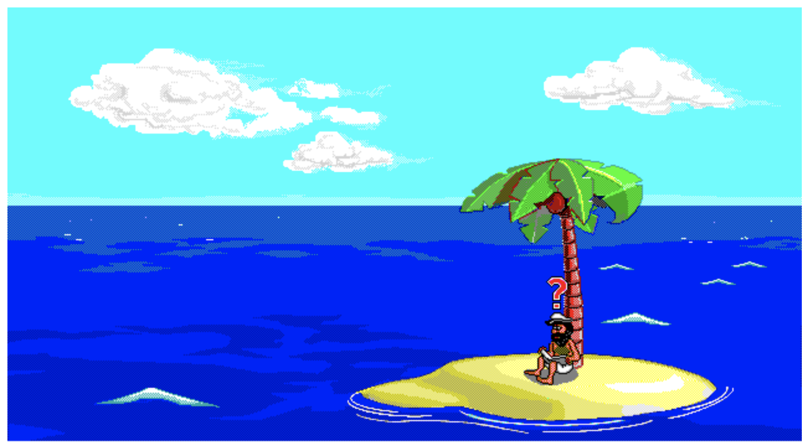

# johnny_web

A web-native reimplementation of the [Johnny Castaway](https://en.wikipedia.org/wiki/Johnny_Castaway) screensaver originally created by Dynamix (Sierra On-Line) in 1992. This project was hard forked from [xesf/castaway](https://github.com/xesf/castaway) and considerably revamed with a focus on idiomatic, standards-based web development.



## Getting started

```bash
npm install
npm run dev       # http://localhost:5173
```

Game data files are required — see [Obtaining the Game Data Files](#obtaining-the-game-data-files) below.

## Purpose

- Reimplementation of the Johnny Castaway screensaver in the browser
- Modernize the codebase toward web-native patterns (ES modules, Web APIs, Vite)
- Learn and document the Dynamix Game Development System (DGDS) file formats
- Provide extraction and dump tools via Node.js (for a full desktop asset viewer, see [xesf/dgds-viewer](https://github.com/xesf/dgds-viewer))

## Obtaining the Screensaver Data Files

The screensaver requires three proprietary data files that are not included in
this repository. These files originate from the original 1992/1993 Windows 3.1
floppy distribution by Sierra On-Line. See
[Wikipedia](https://en.wikipedia.org/wiki/Johnny_Castaway) for history.

**Legal note:** Johnny Castaway is technically still under copyright (see
[NOTICE](NOTICE)). It has never been officially released as freeware.
However, it has been commercially unavailable for 30+ years, is widely
considered abandonware, and no enforcement action has ever been publicly
reported. Obtaining and using it for personal, non-commercial purposes is your
own legal call.

**Note for GitHub Pages users:** The deployed version at
https://johnny_web.pages.dev (or your repo's GitHub Pages URL) includes the
screensaver data automatically and works out of the box. You only need to
extract the data files if you're running locally.

### Known sources

| Source | What you get | Notes |
|--------|-------------|-------|
| [Internet Archive](https://archive.org/details/screen-antics-johnny-castaway-16-color-v1.01-int.-1.4.93-win3.1-1.44m) | Win3.1 floppy `.ima` inside a ZIP | Use `npm run extract` below |
| [My Abandonware](https://www.myabandonware.com/search/q/johnny+castaway) | Likely a pre-extracted installer ZIP | Requires JavaScript in browser |

### Extracting from the Internet Archive floppy image

The `extract` script handles everything: it unpacks the ZIP, mounts the floppy
image, and decompresses the TSComp archives used by the original installer to
produce the screensaver data files.

**Prerequisites** (one-time setup):

```bash
# macOS
brew install mtools

# Linux (Debian/Ubuntu)
apt install mtools unzip
```

**Run the extractor:**

```bash
# 1. Download the ZIP from Internet Archive (~1.4 MB)
curl -L -O "https://archive.org/download/screen-antics-johnny-castaway-16-color-v1.01-int.-1.4.93-win3.1-1.44m/Screen%20Antics%20-%20Johnny%20Castaway%20(16%20Color)%20(v1.01%2C%20Int.%201.4.93)%20(Win3.1)%20(1.44M).zip"

# 2. Extract the game data files into public/data/
npm run extract -- "<path-to-downloaded.zip>"
```

The script writes `public/data/RESOURCE.MAP`, `RESOURCE.001`, and
`SCRANTIC.SCR` (the screensaver data files) and then cleans up all temporary
files.

## npm scripts

| Command | Description |
|---------|-------------|
| `npm run dev` | Start Vite dev server at http://localhost:5173 |
| `npm run build` | Production build to `dist/` |
| `npm run preview` | Serve the `dist/` build locally |
| `npm run extract -- "<zip>"` | Extract screensaver data from Archive.org ZIP |
| `npm test` | Run the Vitest test suite |
| `npm run test:coverage` | Run the Vitest test suite with Istanbul coverage |
| `npm run dump` | Dump screensaver assets to `dumps/` for inspection |

## GitHub Pages

Pushes to `main` automatically deploy to GitHub Pages via the workflow in
`.github/workflows/deploy.yml`. The workflow downloads and extracts the game
data from the Internet Archive, so the deployed version is fully functional.

Enable Pages in your repo settings
(**Settings → Pages → Source: GitHub Actions**).

If your repo lives at a path other than `/johnny_web/`, update `VITE_BASE_PATH`
in the workflow file.

**Note:** For local development, you still need to extract the game data files
yourself (see below). The GitHub Pages deployment handles this automatically.

## Docs

- [Resource Index File Format](docs/resindex.md)
- [Architecture](docs/architecture.md)
- [NOTICE](NOTICE) — IP attribution and copyright details
- [CHANGELOG](CHANGELOG.md)
- [CONTRIBUTING](CONTRIBUTING.md)

## Acknowledgements

See [NOTICE](NOTICE) for full IP attribution, original project credits, and special thanks.
