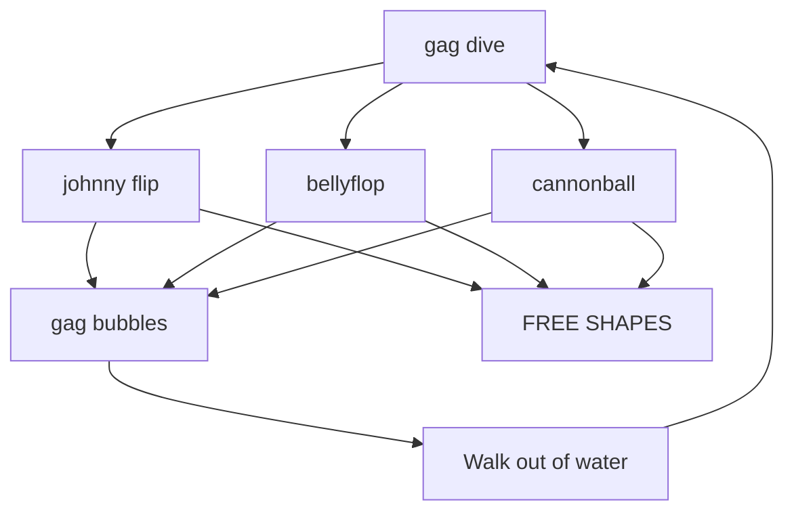
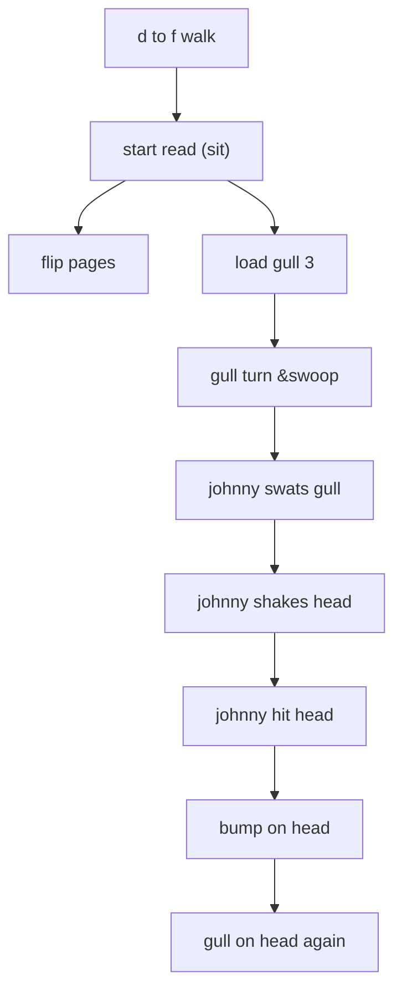
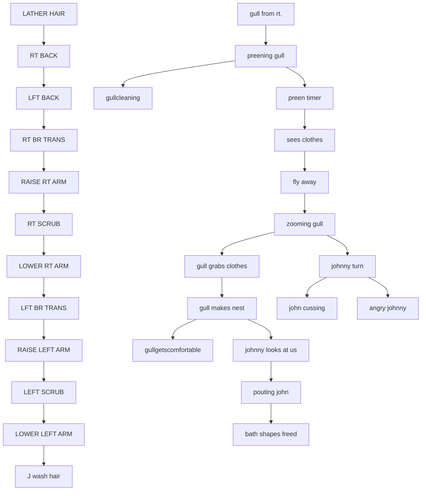
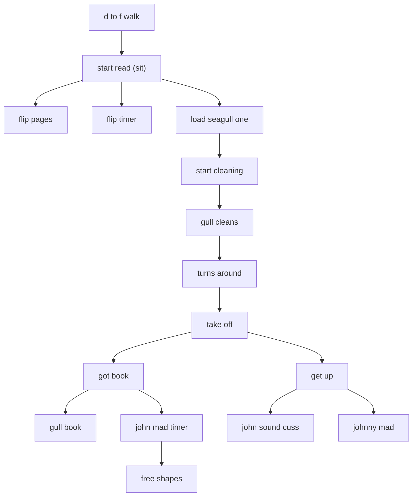
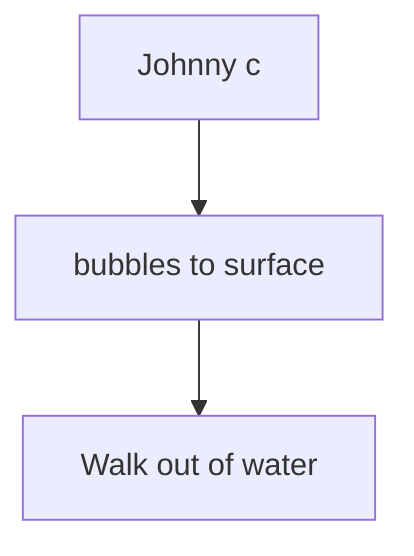
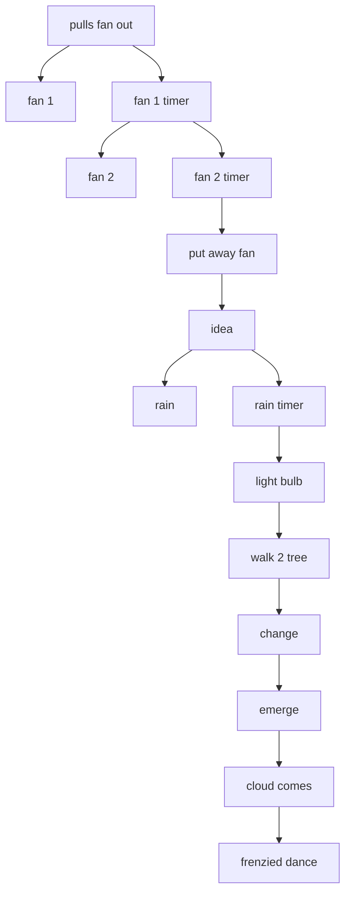
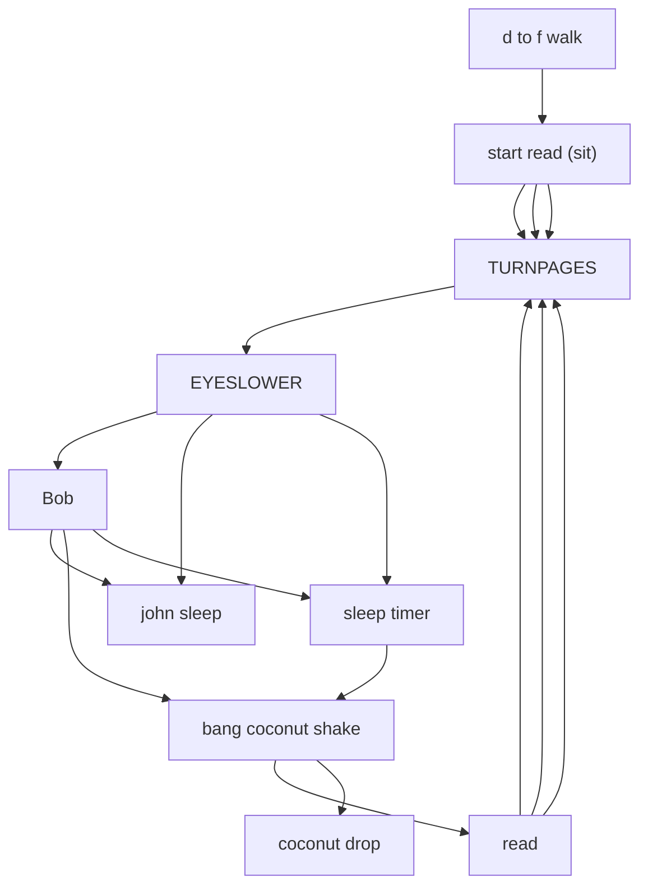
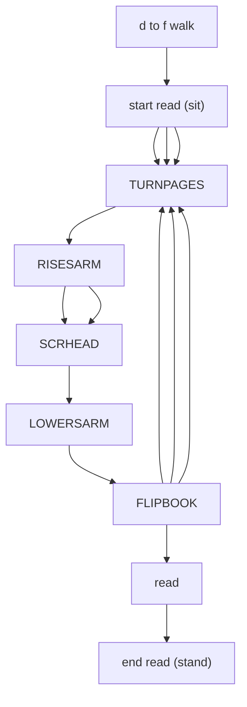
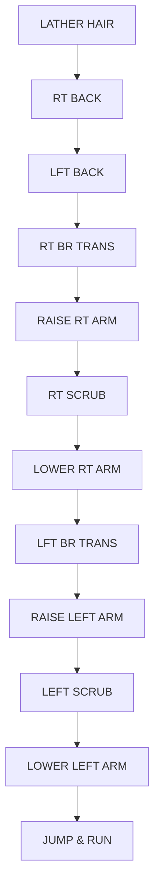
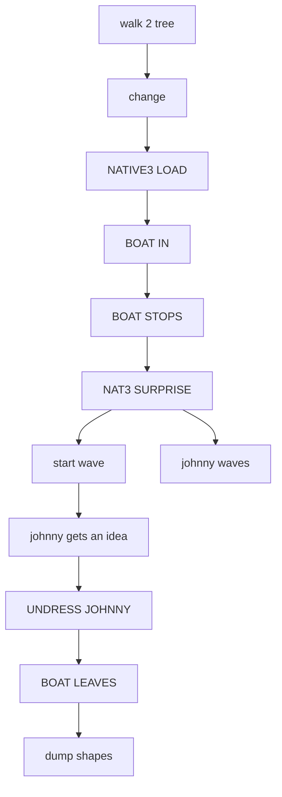

# ACTIVITY.ADS scene flows

Generated by `tools/faithfulness-oracle/scene-flow-doc.mjs` from the original ADS data — do not edit by hand; regenerate with `node tools/faithfulness-oracle/scene-flow-doc.mjs`.

Pairs with [../story-over-time.md](../story-over-time.md), which covers the calendar-driven story arc across gags; this doc covers the scripted flow *within* each of this file's gags.

## GAG DIVES (`ACTIVITY.ADS` tag 1)

- **at the start** → "LOAD SHAPES", "gag dive"
- **after "gag dive"** picks one of "johnny flip", "bellyflop", "cannonball"
- **after "johnny flip" or "bellyflop" or "cannonball"** picks one of "gag bubbles", "FREE SHAPES"
- **after "gag bubbles"** → "Walk out of water"
- **after "Walk out of water"** → "gag dive"

## GULL 3 STILL READING (`ACTIVITY.ADS` tag 12)

- **at the start** → "d to f walk"
- **after "d to f walk"** → "start read (sit)"
- **after "start read (sit)"** → "flip pages", "load gull 3"
- **after "load gull 3"** → "gull turn &swoop"
- **after "gull turn &swoop"** → "johnny swats gull", stop "flip pages"
- **after "johnny swats gull"** → "johnny shakes head"
- **after "johnny shakes head"** → "johnny hit head"
- **after "johnny hit head"** → "bump on head"
- **after "bump on head"** → "gull on head again"

## GULL 2 BATHING (`ACTIVITY.ADS` tag 11)

- **at the start** → "LOAD BATH", "load bath shapes", "clothes on stick", "LATHER HAIR", "Hum in ocean", "gull from rt."
- **after "LATHER HAIR"** → "RT BACK"
- **after "RT BACK"** → "LFT BACK"
- **after "LFT BACK"** → "RT BR TRANS"
- **after "RT BR TRANS"** → "RAISE RT ARM"
- **after "RAISE RT ARM"** → "RT SCRUB"
- **after "gull from rt."** → "preening gull"
- **after "preening gull"** → "gullcleaning", "preen timer"
- **after "preen timer"** → "sees clothes", stop "gullcleaning"
- **after "sees clothes"** → "fly away"
- **after "fly away"** → "zooming gull"
- **after "RT SCRUB"** → "LOWER RT ARM"
- **after "LOWER RT ARM"** → "LFT BR TRANS"
- **after "LFT BR TRANS"** → "RAISE LEFT ARM"
- **after "RAISE LEFT ARM"** → "LEFT SCRUB"
- **after "LEFT SCRUB"** → "LOWER LEFT ARM"
- **after "LOWER LEFT ARM"** → "J wash hair"
- **after "zooming gull"** → "gull grabs clothes", "johnny turn", stop "J wash hair", stop "clothes on stick"
- **after "gull grabs clothes"** → "gull makes nest"
- **after "johnny turn"** → "john cussing", "angry johnny"
- **after "gull makes nest"** → "gullgetscomfortable", "johnny looks at us", stop "angry johnny"
- **after "johnny looks at us"** → "pouting john"
- **after "pouting john"** → "bath shapes freed", stop "gullgetscomfortable"

## GULL 1 READING (`ACTIVITY.ADS` tag 10)

- **at the start** → "d to f walk"
- **after "d to f walk"** → "start read (sit)"
- **after "start read (sit)"** → "flip pages", "flip timer", "load seagull one"
- **after "load seagull one"** → "start cleaning"
- **after "start cleaning"** → "gull cleans"
- **after "gull cleans"** → "turns around"
- **after "turns around"** → "take off"
- **after "take off"** → "got book", "get up", stop "flip timer", stop "flip pages"
- **after "got book"** → "gull book", "john mad timer"
- **after "get up"** → "john sound cuss", "johnny mad"
- **after "john mad timer"** → "free shapes", stop "johnny mad", stop "gull book"

## MUNDANE DIVE (`ACTIVITY.ADS` tag 4)

- **at the start** → "Johnny c"
- **after "Johnny c"** → "bubbles to surface"
- **after "bubbles to surface"** → "Walk out of water"

## NATIVE 1 (`ACTIVITY.ADS` tag 5)

- **at the start** → "pulls fan out"
- **after "pulls fan out"** → "fan 1", "fan 1 timer"
- **after "fan 1 timer"** → "fan 2", "fan 2 timer", stop "fan 1"
- **after "fan 2 timer"** → "put away fan", stop "fan 2"
- **after "put away fan"** → "idea"
- **after "idea"** → "rain", "rain timer"
- **after "rain timer"** → "light bulb", stop "rain"
- **after "light bulb"** → "walk 2 tree"
- **after "walk 2 tree"** → "change"
- **after "change"** → "emerge"
- **after "emerge"** → "cloud comes"
- **after "cloud comes"** → "frenzied dance"

## GAG JOHN READ (`ACTIVITY.ADS` tag 6)

- **at the start** → "LOAD READ", "d to f walk"
- **after "d to f walk"** → "start read (sit)"
- **after "start read (sit)" or "read"** picks one of "TURNPAGES", "TURNPAGES", "TURNPAGES"
- **after "TURNPAGES"** → "EYESLOWER"
- **after "EYESLOWER"** picks one of "Bob", "john sleep", "sleep timer"
- **after "Bob"** picks one of "john sleep", "bang  coconut shake", "sleep timer"
- **after "sleep timer"** → "bang  coconut shake", stop "john sleep"
- **after "bang  coconut shake"** picks one of "read", "coconut drop"

## MUNDANE JOHN READ (`ACTIVITY.ADS` tag 7)

- **at the start** → "LOAD READ", "d to f walk"
- **after "d to f walk"** → "start read (sit)"
- **after "start read (sit)"** picks one of "TURNPAGES", "TURNPAGES", "TURNPAGES"
- **after "TURNPAGES"** → "RISESARM"
- **after "RISESARM"** picks one of "SCRHEAD", "SCRHEAD"
- **after "SCRHEAD"** → "LOWERSARM"
- **after "LOWERSARM"** → "FLIPBOOK"
- **after "FLIPBOOK"** picks one of "TURNPAGES", "TURNPAGES", "TURNPAGES", "read"
- **after "read"** → "end read (stand)"

## JOHN BATH (`ACTIVITY.ADS` tag 8)

- **at the start** → "LOAD BATH", "LATHER HAIR", "Hum in ocean"
- **after "LATHER HAIR"** → "RT BACK"
- **after "RT BACK"** → "LFT BACK"
- **after "LFT BACK"** → "RT BR TRANS"
- **after "RT BR TRANS"** → "RAISE RT ARM"
- **after "RAISE RT ARM"** → "RT SCRUB"
- **after "RT SCRUB"** → "LOWER RT ARM"
- **after "LOWER RT ARM"** → "LFT BR TRANS"
- **after "LFT BR TRANS"** → "RAISE LEFT ARM"
- **after "RAISE LEFT ARM"** → "LEFT SCRUB"
- **after "LEFT SCRUB"** → "LOWER LEFT ARM"
- **after "LOWER LEFT ARM"** → "JUMP & RUN"

## NATIVE 3 (`ACTIVITY.ADS` tag 9)

- **at the start** → "walk 2 tree"
- **after "walk 2 tree"** → "change"
- **after "change"** → "NATIVE3 LOAD"
- **after "NATIVE3 LOAD"** → "BOAT IN"
- **after "BOAT IN"** → "BOAT STOPS"
- **after "BOAT STOPS"** → "NAT3 SURPRISE"
- **after "NAT3 SURPRISE"** → "start wave", "johnny waves"
- **after "start wave"** → "johnny gets an idea", stop "johnny waves"
- **after "johnny gets an idea"** → "UNDRESS JOHNNY"
- **after "UNDRESS JOHNNY"** → "BOAT LEAVES"
- **after "BOAT LEAVES"** → "dump shapes"

