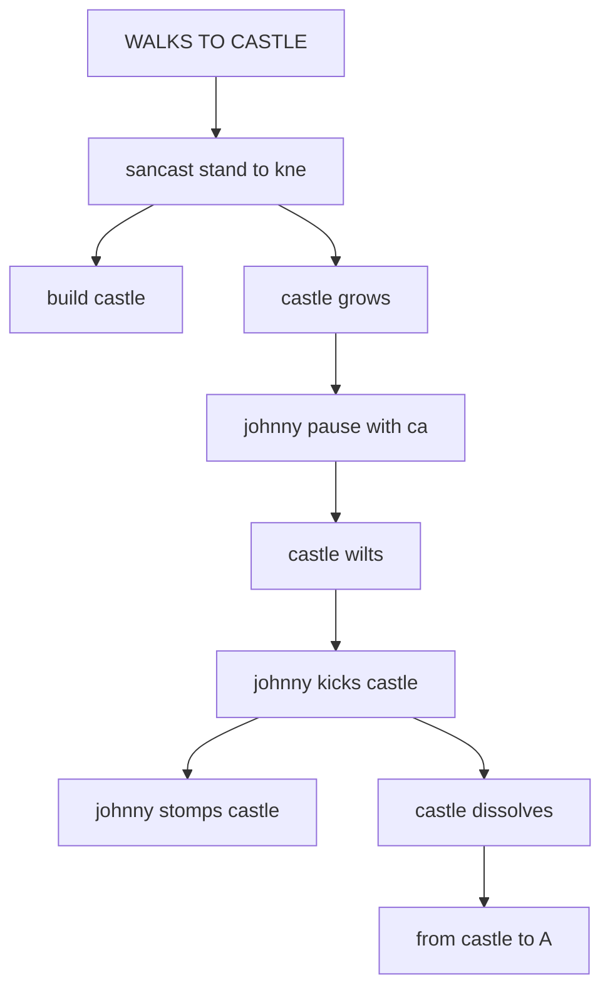
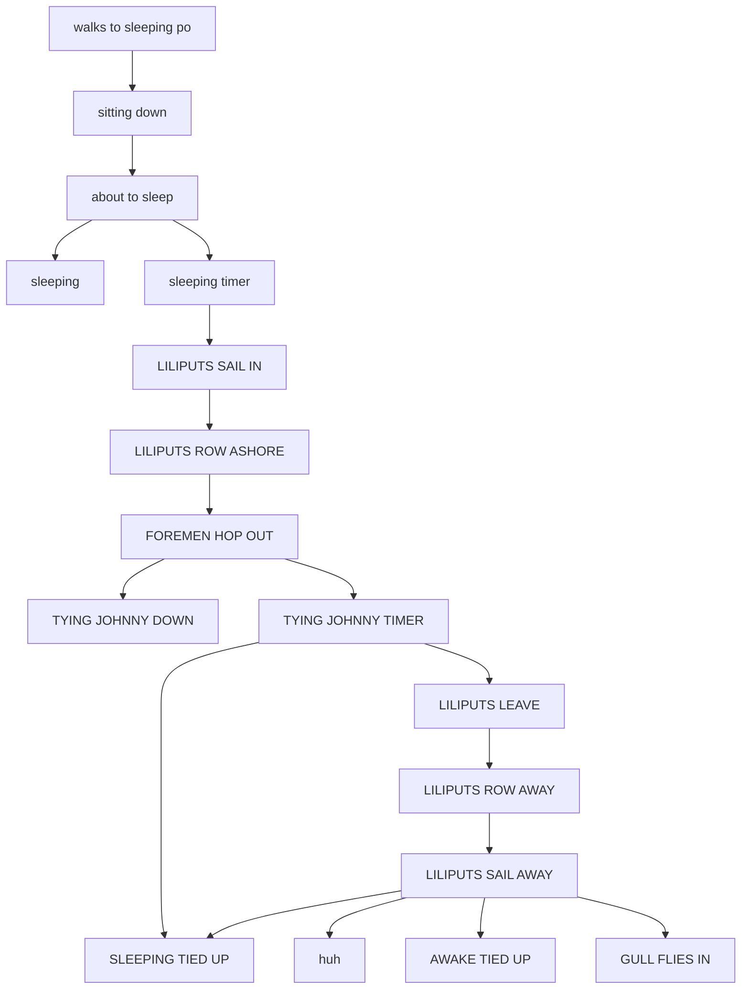
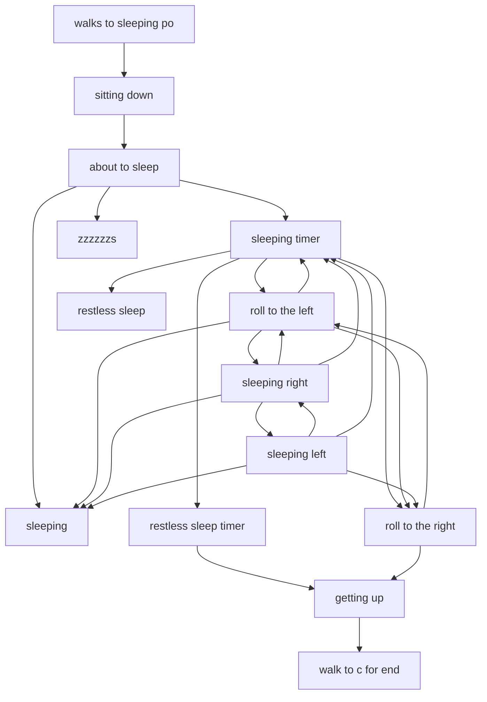
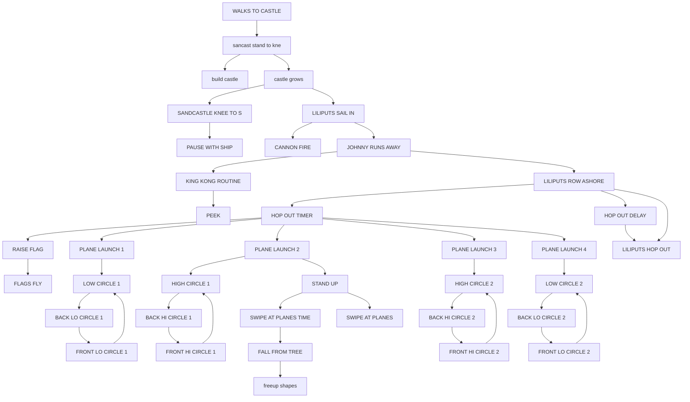
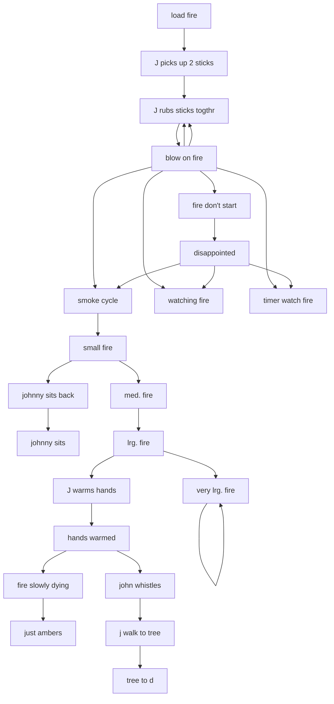
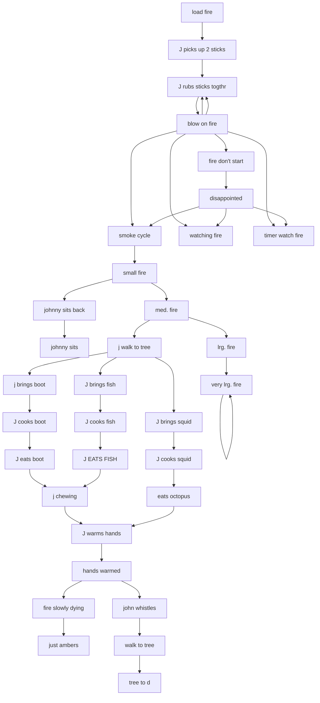
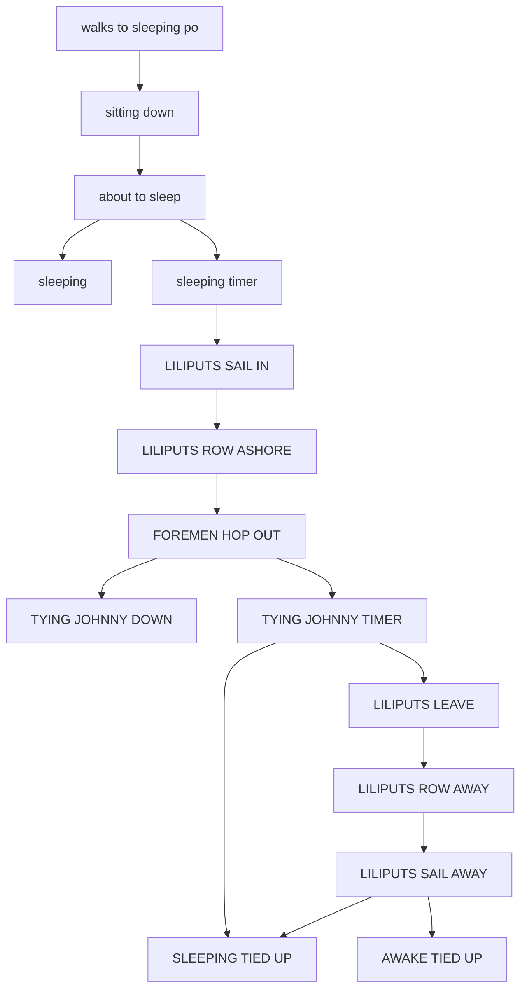

# BUILDING.ADS scene flows

Generated by `tools/faithfulness-oracle/scene-flow-doc.mjs` from the original ADS data — do not edit by hand; regenerate with `node tools/faithfulness-oracle/scene-flow-doc.mjs`.

Pairs with [../story-over-time.md](../story-over-time.md), which covers the calendar-driven story arc across gags; this doc covers the scripted flow *within* each of this file's gags.

## MJSAND (`BUILDING.ADS` tag 1)

- **at the start** → "sandcastle load", "WALKS TO CASTLE"
- **after "WALKS TO CASTLE"** → "sancast stand to kne"
- **after "sancast stand to kne"** → "build castle", "castle grows"
- **after "castle grows"** → "johnny pause with ca", stop "build castle"
- **after "johnny pause with ca"** → "castle wilts"
- **after "castle wilts"** → "johnny kicks castle"
- **after "johnny kicks castle"** → "johnny stomps castle", "castle dissolves"
- **after "castle dissolves"** → "from castle to A", stop "johnny stomps castle"

## LILIPUT 1 (`BUILDING.ADS` tag 4)

- **at the start** → "load mjsleep", "walks to sleeping po"
- **after "walks to sleeping po"** → "sitting down"
- **after "sitting down"** → "about to sleep"
- **after "about to sleep"** → "sleeping", "sleeping timer"
- **after "sleeping timer"** → "LILIPUTS SAIL IN"
- **after "LILIPUTS SAIL IN"** → "LILIPUTS ROW ASHORE"
- **after "LILIPUTS ROW ASHORE"** → "FOREMEN HOP OUT"
- **after "FOREMEN HOP OUT"** → "TYING JOHNNY DOWN", "TYING JOHNNY TIMER"
- **after "TYING JOHNNY TIMER"** → "SLEEPING TIED UP", "LILIPUTS LEAVE", stop "sleeping", stop "TYING JOHNNY DOWN"
- **after "LILIPUTS LEAVE"** → "LILIPUTS ROW AWAY"
- **after "LILIPUTS ROW AWAY"** → "LILIPUTS SAIL AWAY"
- **after "LILIPUTS SAIL AWAY"** → "SLEEPING TIED UP", "huh", "AWAKE TIED UP", "GULL FLIES IN", stop "SLEEPING TIED UP", stop "huh"
- **after "GULL FLIES IN"** → stop "AWAKE TIED UP"

## MUNDANE SLEEP (`BUILDING.ADS` tag 3)

- **at the start** → "load mjsleep", "walks to sleeping po"
- **after "walks to sleeping po"** → "sitting down"
- **after "sitting down"** → "about to sleep"
- **after "about to sleep"** → "sleeping", "sleeping timer", "zzzzzzs"
- **after "sleeping timer"** picks one of "roll to the left", "roll to the right", "restless sleep", "restless sleep timer", stop "sleeping", stop "zzzzzzs"
- **after "restless sleep timer"** → "getting up", stop "restless sleep"
- **after "roll to the left"** picks one of "roll to the right", "sleeping", "sleeping right", "sleeping timer"
- **after "sleeping right"** picks one of "sleeping", "roll to the left", "sleeping left", "sleeping timer"
- **after "sleeping left"** picks one of "sleeping", "sleeping right", "roll to the right", "sleeping timer"
- **after "roll to the right"** picks one of "getting up", "roll to the left", stop "zzzzzzs"
- **after "getting up"** → "walk to c for end"

## LILIPUT 2 (`BUILDING.ADS` tag 2)

- **at the start** → "sandcastle load", "WALKS TO CASTLE"
- **after "WALKS TO CASTLE"** → "sancast stand to kne"
- **after "sancast stand to kne"** → "build castle", "castle grows"
- **after "castle grows"** → "SANDCASTLE KNEE TO S", "LILIPUTS SAIL IN", stop "build castle"
- **after "SANDCASTLE KNEE TO S"** → "PAUSE WITH SHIP"
- **after "LILIPUTS SAIL IN"** → "CANNON FIRE", "JOHNNY RUNS AWAY", stop "PAUSE WITH SHIP"
- **after "JOHNNY RUNS AWAY"** → "KING KONG ROUTINE", "LILIPUTS ROW ASHORE", stop "CANNON FIRE"
- **after "LILIPUTS ROW ASHORE"** → "HOP OUT TIMER", "HOP OUT DELAY", "LILIPUTS HOP OUT"
- **after "HOP OUT DELAY"** → "LILIPUTS HOP OUT"
- **after "HOP OUT TIMER"** → "RAISE FLAG", "PLANE LAUNCH 1", "PLANE LAUNCH 2", "PLANE LAUNCH 3", "PLANE LAUNCH 4", stop "LILIPUTS HOP OUT"
- **after "RAISE FLAG"** → "FLAGS FLY"
- **after "PLANE LAUNCH 1"** → "LOW CIRCLE 1"
- **after "LOW CIRCLE 1"** → "BACK LO CIRCLE 1"
- **after "BACK LO CIRCLE 1"** → "FRONT LO CIRCLE 1"
- **after "FRONT LO CIRCLE 1"** → "LOW CIRCLE 1"
- **after "PLANE LAUNCH 2"** → "HIGH CIRCLE 1"
- **after "HIGH CIRCLE 1"** → "BACK HI CIRCLE 1"
- **after "BACK HI CIRCLE 1"** → "FRONT HI CIRCLE 1"
- **after "FRONT HI CIRCLE 1"** → "HIGH CIRCLE 1"
- **after "PLANE LAUNCH 3"** → "HIGH CIRCLE 2"
- **after "HIGH CIRCLE 2"** → "BACK HI CIRCLE 2"
- **after "BACK HI CIRCLE 2"** → "FRONT HI CIRCLE 2"
- **after "FRONT HI CIRCLE 2"** → "HIGH CIRCLE 2"
- **after "PLANE LAUNCH 4"** → "LOW CIRCLE 2"
- **after "LOW CIRCLE 2"** → "BACK LO CIRCLE 2"
- **after "BACK LO CIRCLE 2"** → "FRONT LO CIRCLE 2"
- **after "FRONT LO CIRCLE 2"** → "LOW CIRCLE 2"
- **after "KING KONG ROUTINE"** → "PEEK"
- **after "PLANE LAUNCH 2"** → "STAND UP", stop "PEEK"
- **after "STAND UP"** → "SWIPE AT PLANES TIME", "SWIPE AT PLANES"
- **after "SWIPE AT PLANES TIME"** → "FALL FROM TREE", stop "SWIPE AT PLANES"
- **after "FALL FROM TREE"** → "freeup shapes", stop "FLAGS FLY"

## JOHN BUILDS FIRE (`BUILDING.ADS` tag 5)

- **at the start** → "load fire"
- **after "load fire"** → "J picks up 2 sticks"
- **after "J picks up 2 sticks"** → "J rubs sticks togthr"
- **after "J rubs sticks togthr"** → "blow on fire"
- **after "blow on fire"** picks one of "J rubs sticks togthr", "J rubs sticks togthr", "fire don't start", "smoke cycle", "watching fire", "timer watch fire"
- **after "fire don't start"** → "disappointed"
- **after "disappointed"** → "smoke cycle", "watching fire", "timer watch fire"
- **after "smoke cycle"** → "small fire"
- **after "small fire"** → "med. fire", "johnny sits back", stop "watching fire", stop "timer watch fire"
- **after "johnny sits back"** → "johnny sits"
- **after "med. fire"** → "lrg. fire"
- **after "lrg. fire"** → "very lrg. fire", "J warms hands", stop "johnny sits"
- **after "very lrg. fire"** → "very lrg. fire"
- **after "J warms hands"** → "hands warmed", stop "warms hands timer"
- **after "hands warmed"** → "fire slowly dying", "john whistles", stop "very lrg. fire"
- **after "fire slowly dying"** → "just ambers"
- **after "john whistles"** → "j walk to tree"
- **after "j walk to tree"** → "tree to d", stop "just ambers"

## FIRE (NIGHT) (`BUILDING.ADS` tag 9)

- **at the start** → "load fire"
- **after "load fire"** → "J picks up 2 sticks"
- **after "J picks up 2 sticks"** → "J rubs sticks togthr"
- **after "J rubs sticks togthr"** → "blow on fire"
- **after "blow on fire"** picks one of "J rubs sticks togthr", "J rubs sticks togthr", "fire don't start", "smoke cycle", "watching fire", "timer watch fire"
- **after "fire don't start"** → "disappointed"
- **after "disappointed"** → "smoke cycle", "watching fire", "timer watch fire"
- **after "smoke cycle"** → "small fire"
- **after "small fire"** → "med. fire", "johnny sits back", stop "watching fire", stop "timer watch fire"
- **after "johnny sits back"** → "johnny sits"
- **after "med. fire"** → "lrg. fire"
- **after "lrg. fire"** → "very lrg. fire", "J warms hands", stop "johnny sits"
- **after "very lrg. fire"** → "very lrg. fire"
- **after "J warms hands"** → "hands warmed", stop "warms hands timer"
- **after "hands warmed"** → "fire slowly dying", "john whistles", stop "very lrg. fire"
- **after "fire slowly dying"** → "just ambers"
- **after "john whistles"** → "j walk to tree"
- **after "j walk to tree"** → "tree to d", stop "just ambers"

## EAT (`BUILDING.ADS` tag 7)

- **at the start** → "load fire"
- **after "load fire"** → "J picks up 2 sticks"
- **after "J picks up 2 sticks"** → "J rubs sticks togthr"
- **after "J rubs sticks togthr"** → "blow on fire"
- **after "blow on fire"** picks one of "J rubs sticks togthr", "J rubs sticks togthr", "fire don't start", "smoke cycle", "watching fire", "timer watch fire"
- **after "fire don't start"** → "disappointed"
- **after "disappointed"** → "smoke cycle", "watching fire", "timer watch fire"
- **after "smoke cycle"** → "small fire"
- **after "small fire"** → "med. fire", "johnny sits back", stop "watching fire", stop "timer watch fire"
- **after "johnny sits back"** → "johnny sits"
- **after "med. fire"** → "lrg. fire", "j walk to tree", stop "johnny sits"
- **after "lrg. fire"** → "very lrg. fire"
- **after "very lrg. fire"** → "very lrg. fire"
- **after "j walk to tree"** picks one of "J brings fish", "j brings boot", "J brings squid"
- **after "j brings boot"** → "J cooks boot"
- **after "J cooks boot"** → "J eats boot"
- **after "J eats boot"** → "j chewing"
- **after "J brings squid"** → "J cooks squid"
- **after "J cooks squid"** → "eats octopus"
- **after "J brings fish"** → "J cooks fish"
- **after "J cooks fish"** → "J EATS FISH"
- **after "J EATS FISH"** → "j chewing"
- **after "j chewing" or "eats octopus"** → "J warms hands"
- **after "J warms hands"** → "hands warmed"
- **after "hands warmed"** → "john whistles", "fire slowly dying", stop "very lrg. fire"
- **after "fire slowly dying"** → "just ambers"
- **after "john whistles"** → "walk to tree"
- **after "walk to tree"** → "tree to d", stop "just ambers"

## EAT (NIGHT) (`BUILDING.ADS` tag 8)

- **at the start** → "load fire"
- **after "load fire"** → "J picks up 2 sticks"
- **after "J picks up 2 sticks"** → "J rubs sticks togthr"
- **after "J rubs sticks togthr"** → "blow on fire"
- **after "blow on fire"** picks one of "J rubs sticks togthr", "J rubs sticks togthr", "fire don't start", "smoke cycle", "watching fire", "timer watch fire"
- **after "fire don't start"** → "disappointed"
- **after "disappointed"** → "smoke cycle", "watching fire", "timer watch fire"
- **after "smoke cycle"** → "small fire"
- **after "small fire"** → "med. fire", "johnny sits back", stop "watching fire", stop "timer watch fire"
- **after "johnny sits back"** → "johnny sits"
- **after "med. fire"** → "lrg. fire", "j walk to tree", stop "johnny sits"
- **after "lrg. fire"** → "very lrg. fire"
- **after "very lrg. fire"** → "very lrg. fire"
- **after "j walk to tree"** picks one of "J brings fish", "j brings boot", "J brings squid"
- **after "j brings boot"** → "J cooks boot"
- **after "J cooks boot"** → "J eats boot"
- **after "J eats boot"** → "j chewing"
- **after "J brings squid"** → "J cooks squid"
- **after "J cooks squid"** → "eats octopus"
- **after "J brings fish"** → "J cooks fish"
- **after "J cooks fish"** → "J EATS FISH"
- **after "J EATS FISH"** → "j chewing"
- **after "j chewing" or "eats octopus"** → "J warms hands"
- **after "J warms hands"** → "hands warmed"
- **after "hands warmed"** → "john whistles", "fire slowly dying", stop "very lrg. fire"
- **after "fire slowly dying"** → "just ambers"
- **after "john whistles"** → "walk to tree"
- **after "walk to tree"** → "tree to d", stop "just ambers"

## LILIPUT 3 NIGHT (`BUILDING.ADS` tag 6)

- **at the start** → "load mjsleep", "walks to sleeping po"
- **after "walks to sleeping po"** → "sitting down"
- **after "sitting down"** → "about to sleep"
- **after "about to sleep"** → "sleeping", "sleeping timer"
- **after "sleeping timer"** → "LILIPUTS SAIL IN"
- **after "LILIPUTS SAIL IN"** → "LILIPUTS ROW ASHORE"
- **after "LILIPUTS ROW ASHORE"** → "FOREMEN HOP OUT"
- **after "FOREMEN HOP OUT"** → "TYING JOHNNY DOWN", "TYING JOHNNY TIMER"
- **after "TYING JOHNNY TIMER"** → "SLEEPING TIED UP", "LILIPUTS LEAVE", stop "sleeping", stop "TYING JOHNNY DOWN"
- **after "LILIPUTS LEAVE"** → "LILIPUTS ROW AWAY"
- **after "LILIPUTS ROW AWAY"** → "LILIPUTS SAIL AWAY"
- **after "LILIPUTS SAIL AWAY"** → "SLEEPING TIED UP", "AWAKE TIED UP", stop "SLEEPING TIED UP"

