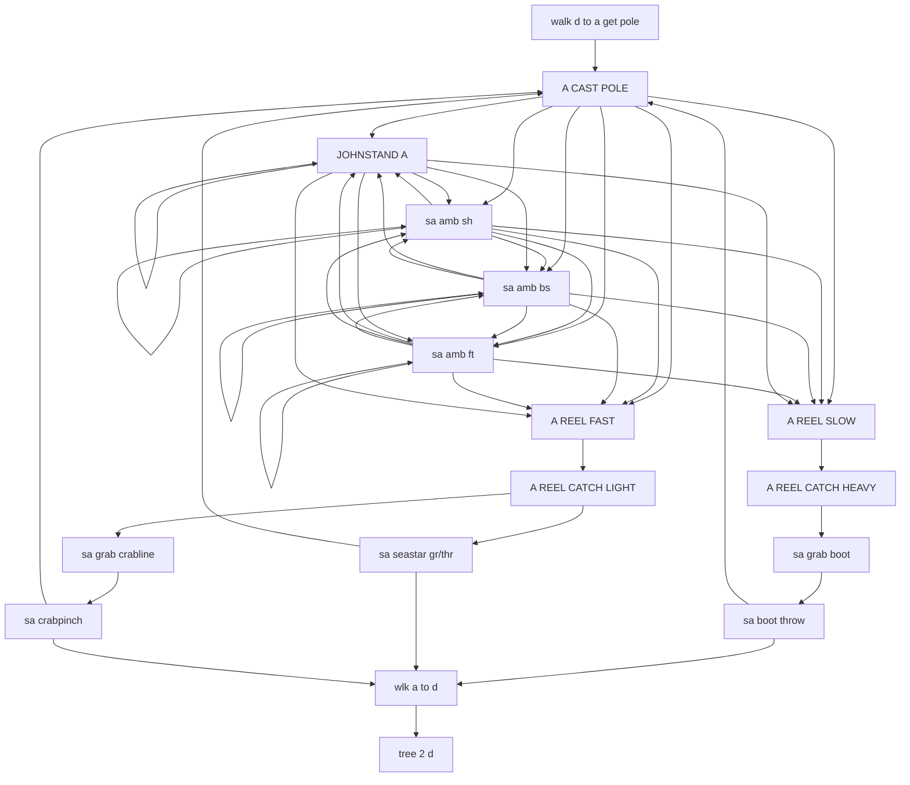
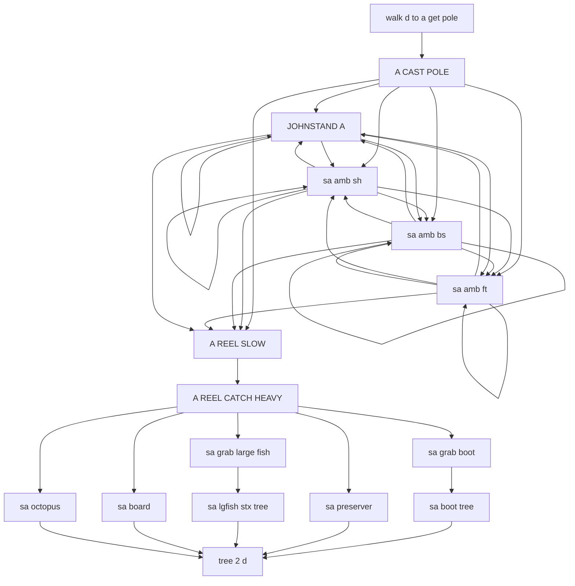
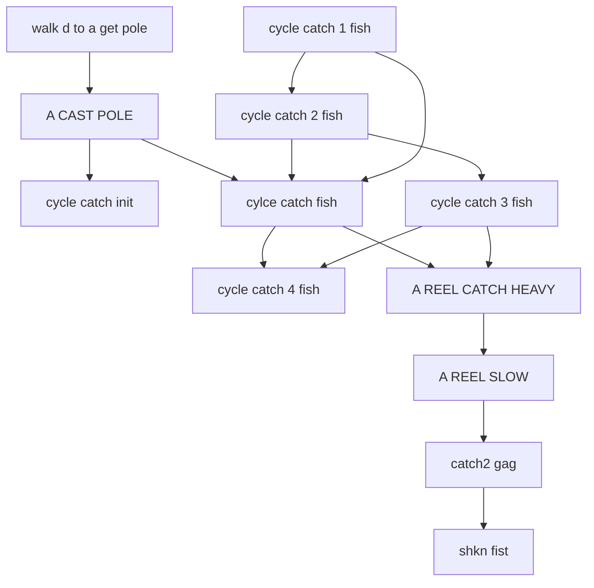
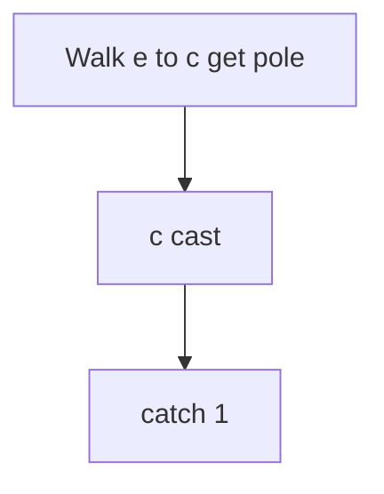
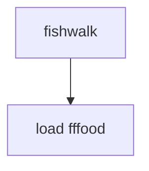
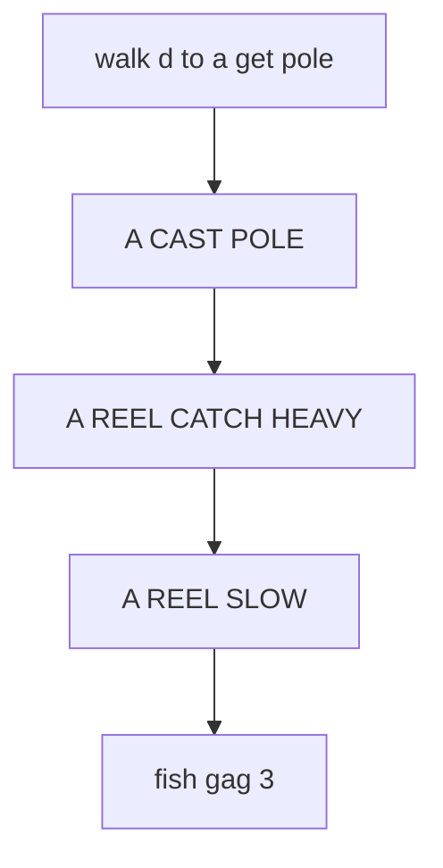
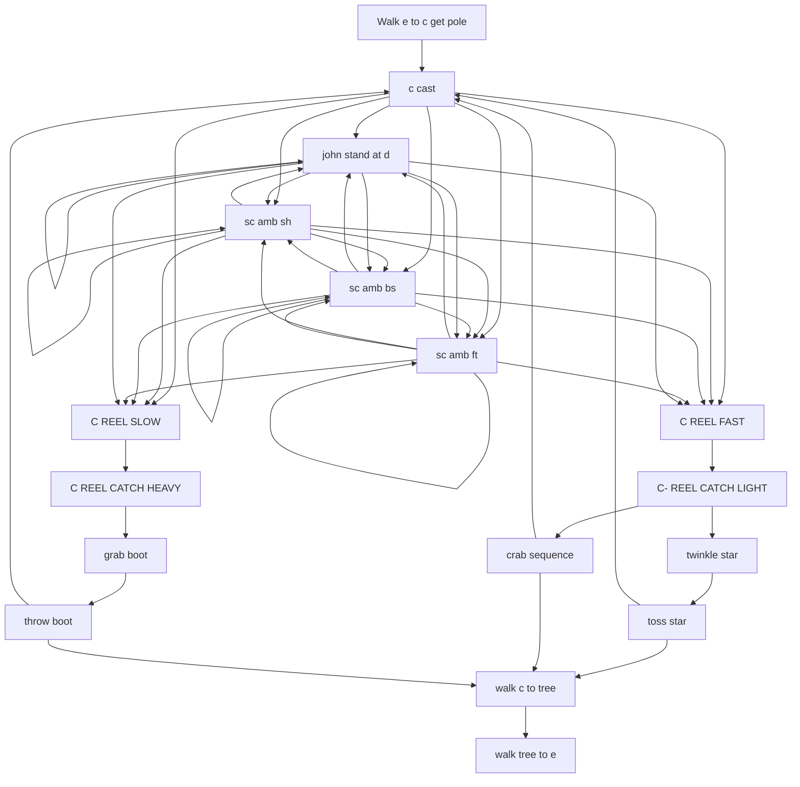
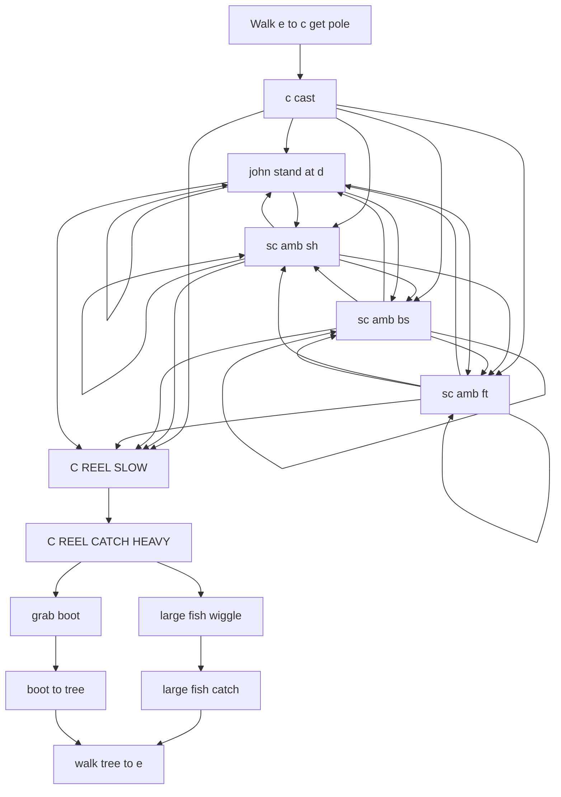

# FISHING.ADS scene flows

Generated by `tools/faithfulness-oracle/scene-flow-doc.mjs` from the original ADS data — do not edit by hand; regenerate with `node tools/faithfulness-oracle/scene-flow-doc.mjs`.

These diagrams come from the original game scripts and show how each gag can unfold. They include conditions, choices, and retry paths, but not exact timing or the result of a random choice. See [Johnny's 11-day story](../story-over-time.md) for how gags are chosen over time.

## FISH AT A (JUNK) (`FISHING.ADS` tag 1)

- **at the start** → "LOAD FISHING", "walk d to a get pole"
- **after "walk d to a get pole"** → "A CAST POLE"
- **after "A CAST POLE" or "sa amb sh" or "sa amb bs" or "sa amb ft" or "JOHNSTAND A"** picks one of "JOHNSTAND A", "sa amb sh", "sa amb bs", "sa amb ft", "A REEL FAST", "A REEL SLOW"
- **after "A REEL SLOW"** → "A REEL CATCH HEAVY"
- **after "A REEL CATCH HEAVY"** → "sa grab boot"
- **after "sa grab boot"** → "sa boot throw"
- **after "A REEL FAST"** → "A REEL CATCH LIGHT"
- **after "A REEL CATCH LIGHT"** picks one of "sa grab crabline", "sa seastar gr/thr"
- **after "sa grab crabline"** → "sa crabpinch"
- **after "sa boot throw" or "sa seastar gr/thr" or "sa crabpinch"** picks one of "A CAST POLE", "wlk a to d"
- **after "wlk a to d"** → "tree 2 d"

## FISH AT A KEEPERS (`FISHING.ADS` tag 2)

- **at the start** → "LOAD FISHING", "walk d to a get pole"
- **after "walk d to a get pole"** → "A CAST POLE"
- **after "A CAST POLE" or "sa amb sh" or "sa amb bs" or "sa amb ft" or "JOHNSTAND A"** picks one of "JOHNSTAND A", "sa amb sh", "sa amb bs", "sa amb ft", "A REEL SLOW"
- **after "A REEL SLOW"** → "A REEL CATCH HEAVY"
- **after "A REEL CATCH HEAVY"** picks one of "sa grab large fish", "sa grab boot", "sa preserver", "sa board", "sa octopus"
- **after "sa grab large fish"** → "sa lgfish stx tree"
- **after "sa grab boot"** → "sa boot tree"
- **after "sa boot tree" or "sa preserver" or "sa lgfish stx tree" or "sa board" or "sa octopus"** → "tree 2 d"

## EIGHT ARM MENACE (`FISHING.ADS` tag 3)

- **at the start** → "LOAD FISHING", "walk d to a get pole"
- **after "walk d to a get pole"** → "A CAST POLE"
- **after "A CAST POLE"** → "cycle catch init", "cylce catch fish"
- **after "cylce catch fish" or "cycle catch 3 fish"** → "cycle catch 4 fish", "A REEL CATCH HEAVY", stop "cycle catch 3 fish"
- **otherwise, while "cycle catch 2 fish" is on screen** → "cycle catch 3 fish", "cylce catch fish", stop "cycle catch 2 fish"
- **otherwise, while "cycle catch 1 fish" is on screen** → "cycle catch 2 fish", "cylce catch fish", stop "cycle catch 1 fish"
- **otherwise (first time)** → "cycle catch 1 fish", "cylce catch fish"
- **after "A REEL CATCH HEAVY"** → "A REEL SLOW"
- **after "A REEL SLOW"** → "catch2 gag", stop "cycle catch 4 fish"
- **after "catch2 gag"** → "shkn fist"

## CATCH 1 (`FISHING.ADS` tag 4)

- **at the start** → "load fishing c", "Walk e to c get pole"
- **after "Walk e to c get pole"** → "c cast"
- **after "c cast"** → "catch 1"

## FISH EATS FOUL FOOD (`FISHING.ADS` tag 5)

- **at the start** → "fishwalk"
- **after "fishwalk"** → "load fffood"

## CATCH 3 (`FISHING.ADS` tag 6)

- **at the start** → "LOAD FISHING", "walk d to a get pole"
- **after "walk d to a get pole"** → "A CAST POLE"
- **after "A CAST POLE"** → "A REEL CATCH HEAVY"
- **after "A REEL CATCH HEAVY"** → "A REEL SLOW"
- **after "A REEL SLOW"** → "fish gag 3"

## FISH AT C FOR JUNK (`FISHING.ADS` tag 7)

- **at the start** → "load fishing c", "Walk e to c get pole"
- **after "Walk e to c get pole"** → "c cast"
- **after "c cast" or "sc amb sh" or "sc amb bs" or "sc amb ft" or "john stand at d"** picks one of "john stand at d", "sc amb sh", "sc amb bs", "sc amb ft", "C REEL FAST", "C REEL SLOW"
- **after "C REEL SLOW"** → "C REEL CATCH HEAVY"
- **after "C REEL CATCH HEAVY"** → "grab boot"
- **after "grab boot"** → "throw boot"
- **after "C REEL FAST"** → "C- REEL CATCH LIGHT"
- **after "C- REEL CATCH LIGHT"** picks one of "crab sequence", "twinkle star"
- **after "twinkle star"** → "toss star"
- **after "toss star" or "crab sequence" or "throw boot"** picks one of "c cast", "walk c to tree"
- **after "walk c to tree"** → "walk tree to e"

## FISH AT KEEPERS (`FISHING.ADS` tag 8)

- **at the start** → "load fishing c", "Walk e to c get pole"
- **after "Walk e to c get pole"** → "c cast"
- **after "c cast" or "sc amb sh" or "sc amb bs" or "sc amb ft" or "john stand at d"** picks one of "john stand at d", "sc amb sh", "sc amb bs", "sc amb ft", "C REEL SLOW"
- **after "C REEL SLOW"** → "C REEL CATCH HEAVY"
- **after "C REEL CATCH HEAVY"** picks one of "large fish wiggle", "grab boot"
- **after "grab boot"** → "boot to tree"
- **after "large fish wiggle"** → "large fish catch"
- **after "large fish catch" or "boot to tree"** → "walk tree to e"

