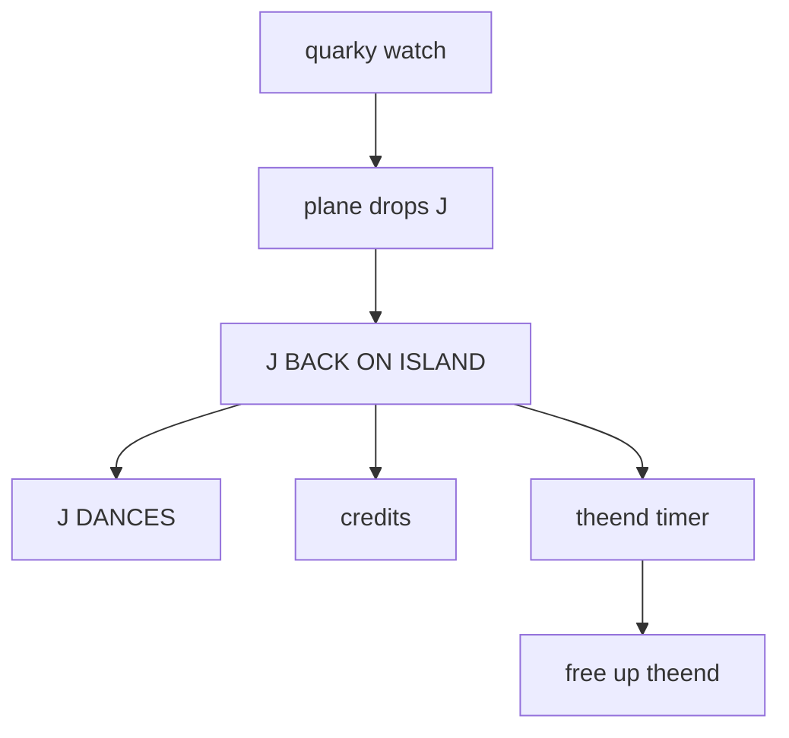
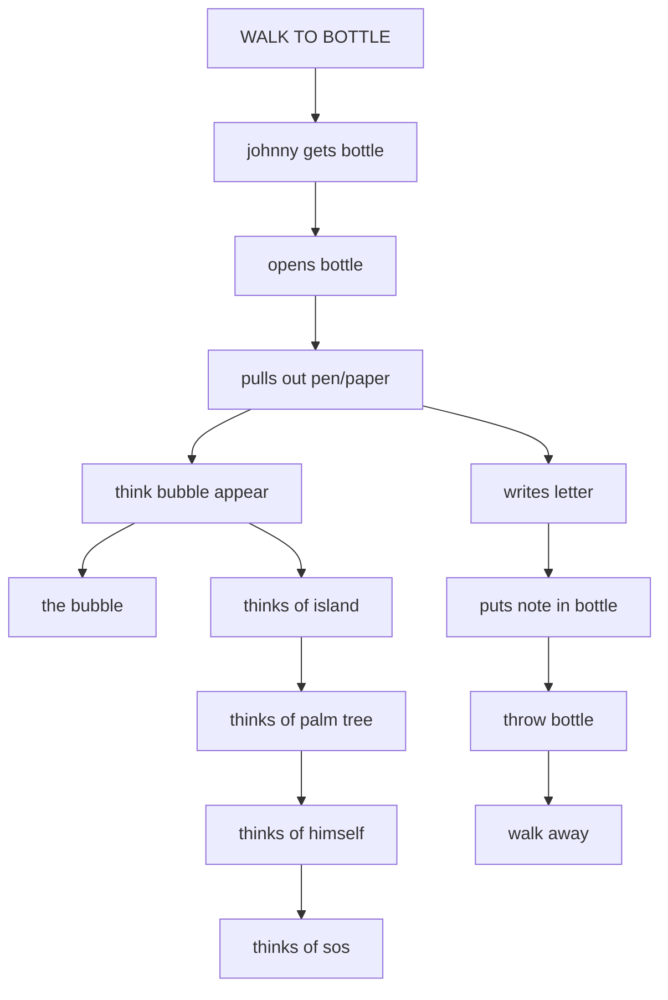
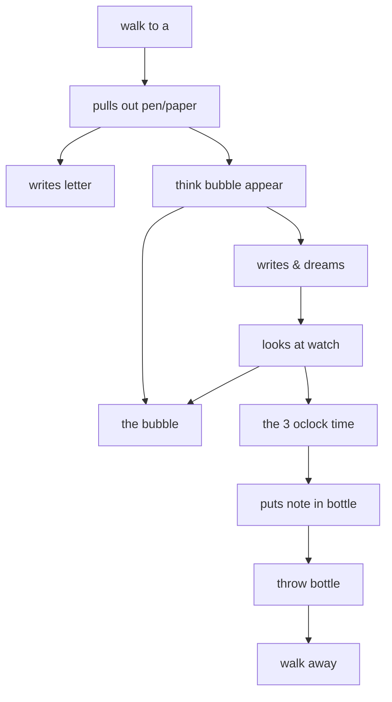
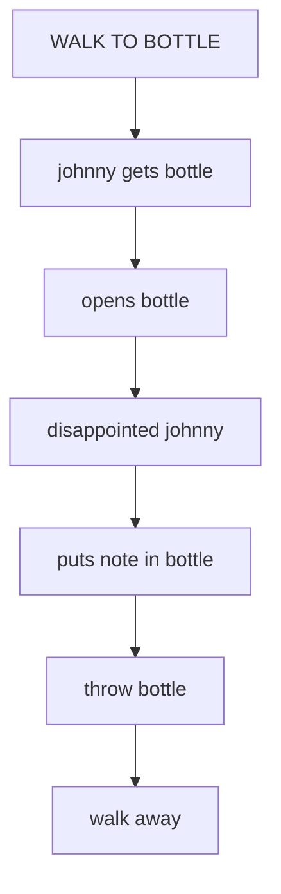
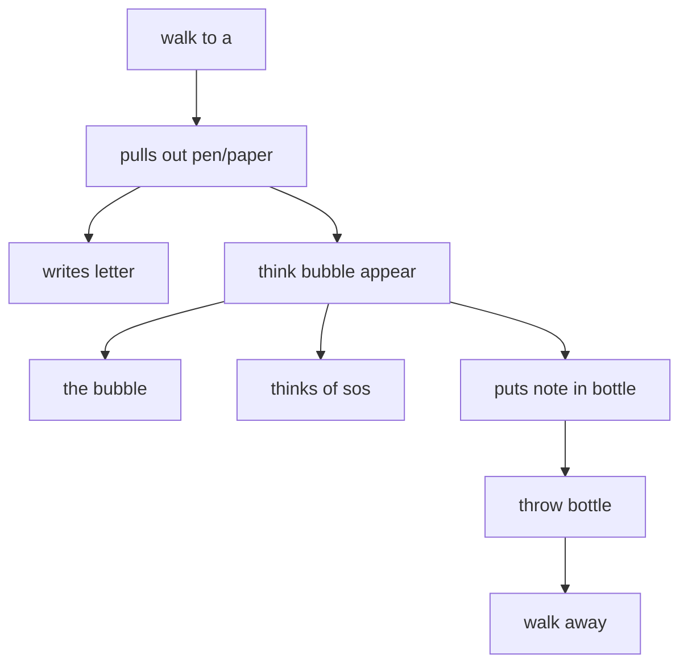
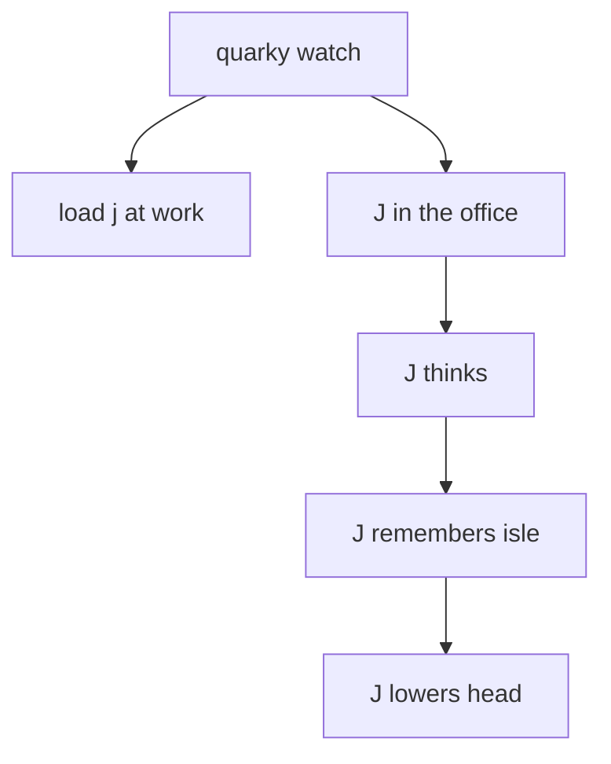

# JOHNNY.ADS scene flows

Generated by `tools/faithfulness-oracle/scene-flow-doc.mjs` from the original ADS data — do not edit by hand; regenerate with `node tools/faithfulness-oracle/scene-flow-doc.mjs`.

These diagrams come from the original game scripts and show how each gag can unfold. They include conditions, choices, and retry paths, but not exact timing or the result of a random choice. See [Johnny's 11-day story](../story-over-time.md) for how gags are chosen over time.

## THE END (`JOHNNY.ADS` tag 1)

- **at the start** → "quarky watch", "load the end"
- **after "quarky watch"** → "plane drops J"
- **after "plane drops J"** → "J BACK ON ISLAND"
- **after "J BACK ON ISLAND"** → "J DANCES", "credits", "theend timer"
- **after "theend timer"** → "free up theend", stop "J DANCES", stop "credits"

## JOHN'S 1ST MESSAGE (`JOHNNY.ADS` tag 2)

- **at the start** → "LOAD MESSAGE", "WALK TO BOTTLE"
- **after "WALK TO BOTTLE"** → "johnny gets bottle"
- **after "johnny gets bottle"** → "opens bottle"
- **after "opens bottle"** → "pulls out pen/paper"
- **after "pulls out pen/paper"** → "writes letter", "think bubble appear"
- **after "think bubble appear"** → "the bubble", "thinks of island"
- **after "thinks of island"** → "thinks of palm tree"
- **after "thinks of palm tree"** → "thinks of himself"
- **after "thinks of himself"** → "thinks of sos"
- **after "writes letter"** → "puts note in bottle"
- **after "puts note in bottle"** → "throw bottle"
- **after "throw bottle"** → "walk away"

## JOHN FINAL MESSAGE (`JOHNNY.ADS` tag 3)

- **at the start** → "LOAD MESSAGE", "walk to a"
- **after "walk to a"** → "pulls out pen/paper"
- **after "pulls out pen/paper"** → "writes letter", "think bubble appear"
- **after "think bubble appear"** → "the bubble", "writes & dreams"
- **after "writes & dreams"** → "looks at watch", stop "dream timer", stop "write timer", stop "the bubble"
- **after "looks at watch"** → "the bubble", "the 3 oclock time"
- **after "the 3 oclock time"** → "puts note in bottle", stop "the bubble", stop "think bubble appear", stop "3 oclock timer"
- **after "puts note in bottle"** → "throw bottle"
- **after "throw bottle"** → "walk away"

## BOTTLE (FIND) (`JOHNNY.ADS` tag 4)

- **at the start** → "LOAD MESSAGE", "WALK TO BOTTLE"
- **after "WALK TO BOTTLE"** → "johnny gets bottle"
- **after "johnny gets bottle"** → "opens bottle"
- **after "opens bottle"** → "disappointed johnny"
- **after "disappointed johnny"** → "puts note in bottle"
- **after "puts note in bottle"** → "throw bottle"
- **after "throw bottle"** → "walk away"

## BOTTLE (THROW) (`JOHNNY.ADS` tag 5)

- **at the start** → "LOAD MESSAGE", "walk to a"
- **after "walk to a"** → "pulls out pen/paper"
- **after "pulls out pen/paper"** → "writes letter", "think bubble appear"
- **after "think bubble appear"** → "the bubble", "thinks of sos"
- **after "think bubble appear"** → "puts note in bottle", stop "the bubble"
- **after "puts note in bottle"** → "throw bottle"
- **after "throw bottle"** → "walk away"

## JOHN AT WORK (`JOHNNY.ADS` tag 6)

- **at the start** → "quarky watch"
- **after "quarky watch"** → "load j at work", "J in the office"
- **after "J in the office"** → "J thinks"
- **after "J thinks"** → "J remembers isle"
- **after "J remembers isle"** → "J lowers head"

