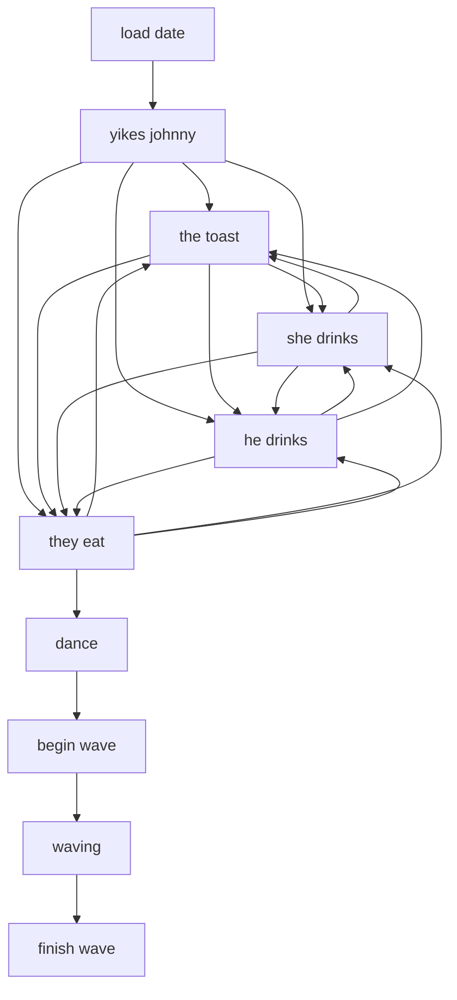
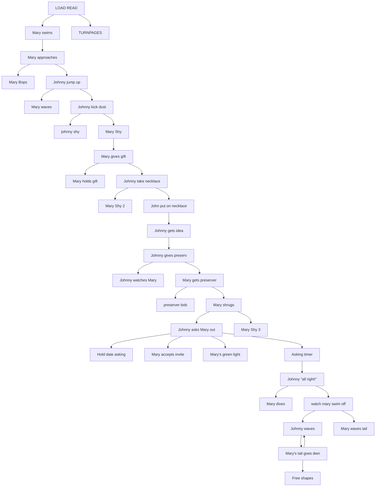
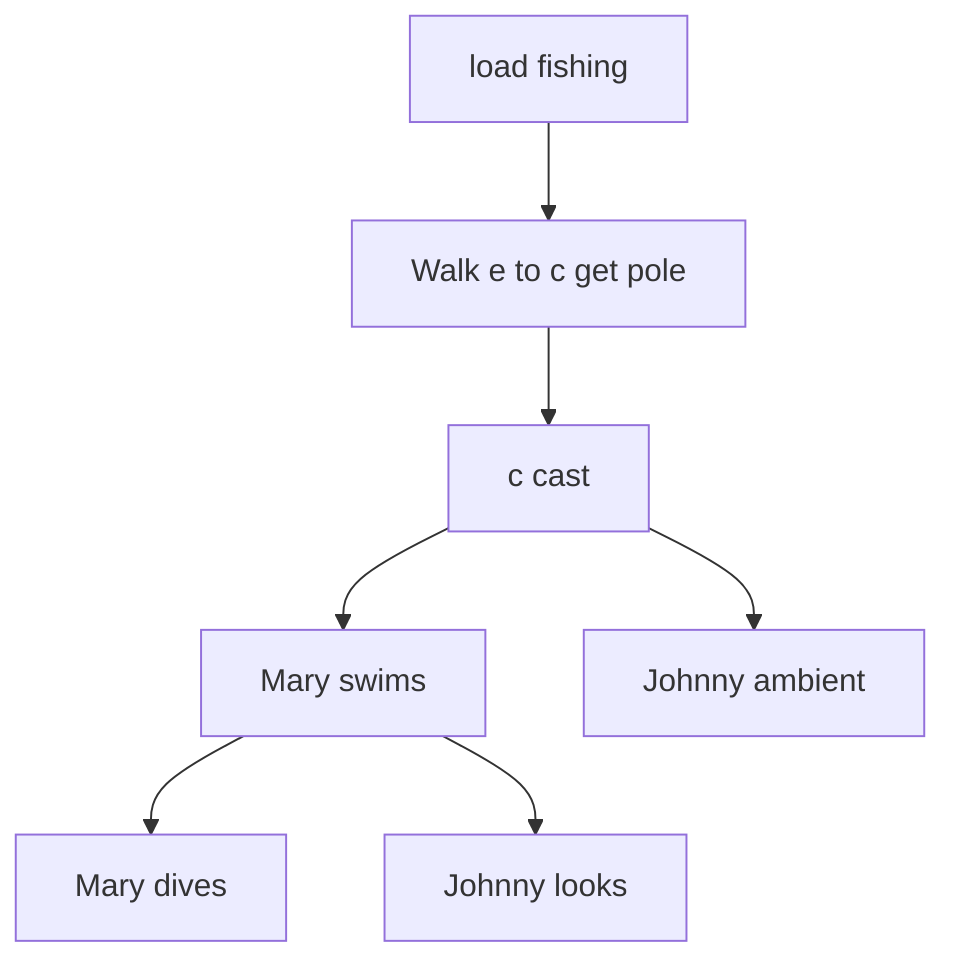
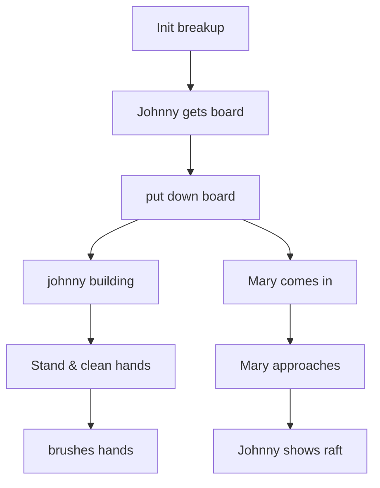
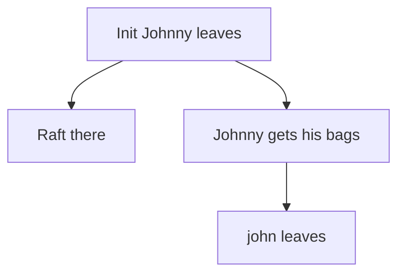

# MARY.ADS scene flows

Generated by `tools/faithfulness-oracle/scene-flow-doc.mjs` from the original ADS data — do not edit by hand; regenerate with `node tools/faithfulness-oracle/scene-flow-doc.mjs`.

These diagrams come from the original game scripts and show how each gag can unfold. They include conditions, choices, and retry paths, but not exact timing or the result of a random choice. See [Johnny's 11-day story](../story-over-time.md) for how gags are chosen over time.

## THE DATE (`MARY.ADS` tag 1)

- **at the start** → "load date"
- **after "load date"** → "yikes johnny"
- **after "yikes johnny"** picks one of "the toast", "she drinks", "he drinks", "they eat"
- **after "the toast"** picks one of "she drinks", "he drinks", "they eat"
- **after "she drinks"** picks one of "he drinks", "they eat", "the toast"
- **after "he drinks"** picks one of "she drinks", "they eat", "the toast"
- **after "they eat"** picks one of "the toast", "she drinks", "he drinks", "dance"
- **after "dance"** → "begin wave"
- **after "begin wave"** → "waving"
- **after "waving"** → "finish wave"

## JOHNNY ASKS FOR DATE (`MARY.ADS` tag 3)

- **at the start** → "LOAD READ"
- **after "LOAD READ"** → "Mary swims", "TURNPAGES"
- **after "Mary swims"** → "Mary approaches"
- **after "Mary approaches"** → "Mary Bops", "Johnny jump up", stop "TURNPAGES"
- **after "Johnny jump up"** → "Mary waves", "Johnny kick dust", stop "Mary Bops"
- **after "Johnny kick dust"** → "johnny shy", "Mary  Shy", stop "Mary waves"
- **after "Mary  Shy"** → "Mary gives gift"
- **after "Mary gives gift"** → "Mary holds gift", "Johnny take necklace", stop "johnny shy"
- **after "Johnny take necklace"** → "Mary Shy 2", "John put on necklace", stop "Mary holds gift"
- **after "John put on necklace"** → "Johnny gets idea"
- **after "Johnny gets idea"** → "Johnny gives preserv"
- **after "Johnny gives preserv"** → "Johnny watches Mary", "Mary gets preserver", stop "Mary Shy 2"
- **after "Mary gets preserver"** → "preserver bob", "Mary shrugs"
- **after "Mary shrugs"** → "Johnny asks Mary out", "Mary Shy 3", stop "Johnny watches Mary"
- **after "Johnny asks Mary out"** → "Hold date asking", "Mary accepts invite", "Mary's green light", "Asking timer", stop "Mary Shy 3"
- **after "Asking timer"** → "Johnny "all right!"", stop "Hold date asking", stop "Mary's green light"
- **after "Johnny "all right!""** → "Mary dives", "watch mary swim off", stop "Mary accepts invite"
- **after "watch mary swim off"** → "Johnny waves", "Mary waves tail"
- **after "Johnny waves"** → "Mary's tail goes dwn", stop "Mary waves tail", stop "preserver bob"
- **otherwise, while "Mary's tail goes dwn" is on screen** → "Johnny waves"
- **after "Mary's tail goes dwn"** → "Free shapes", stop "Johnny waves"

## JOHNNY GLIMPLSE MARY (`MARY.ADS` tag 2)

- **at the start** → "load fishing"
- **after "load fishing"** → "Walk e to c get pole"
- **after "Walk e to c get pole"** → "c cast"
- **after "c cast"** → "Mary swims", "Johnny ambient"
- **after "Mary swims"** → "Mary dives", "Johnny looks", stop "Johnny ambient"

## JOHN & MARY BREAK UP (`MARY.ADS` tag 4)

- **at the start** → "Init breakup"
- **after "Init breakup"** → "Johnny gets board"
- **after "Johnny gets board"** → "put down board"
- **after "put down board"** → "johnny building", "Mary comes in"
- **after "johnny building"** → "Stand & clean hands", stop "building timer"
- **after "Stand & clean hands"** → "brushes hands"
- **after "Mary comes in"** → "Mary approaches", stop "brushes hands"
- **after "Mary approaches"** → "Johnny shows raft"

## JOHNNY LEAVES (`MARY.ADS` tag 5)

- **at the start** → "Init Johnny leaves"
- **after "Init Johnny leaves"** → "Raft there", "Johnny gets his bags"
- **after "Johnny gets his bags"** → "john leaves", stop "Raft there"

