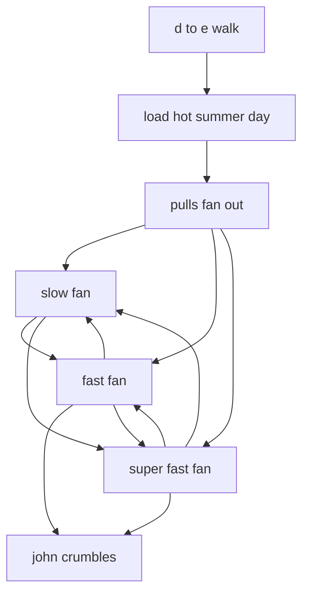
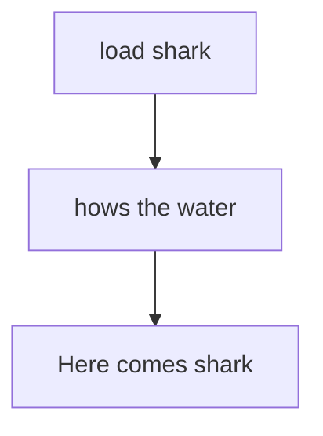

# MISCGAG.ADS scene flows

Generated by `tools/faithfulness-oracle/scene-flow-doc.mjs` from the original ADS data — do not edit by hand; regenerate with `node tools/faithfulness-oracle/scene-flow-doc.mjs`.

A readable projection of each gag's authored ADS branch logic — guards, branches, and RANDOM picks — rendered through the SAME slot model the engine runs (`buildAdsSlots` in `src/dgds/scripting/ads-slots.mjs`), so a branch that is really a *fall-through* rung of a retry ladder reads as one ("otherwise…") rather than as a second independent start. It is faithful to the authored entry/fall-through structure; it is not a literal tick-by-tick trace (RANDOM picks and timing are decided at runtime). Pairs with [../story-over-time.md](../story-over-time.md), which covers the calendar-driven story arc across gags; this doc covers the scripted flow *within* each of this file's gags.

## HOT SUMMER DAYS (`MISCGAG.ADS` tag 1)

- **at the start** → "d to e walk"
- **after "d to e walk"** → "load hot summer day"
- **after "load hot summer day"** → "pulls fan out"
- **after "pulls fan out"** picks one of "slow fan", "fast fan", "super fast fan"
- **after "slow fan"** picks one of "fast fan", "super fast fan"
- **after "fast fan"** picks one of "slow fan", "john crumbles", "super fast fan"
- **after "super fast fan"** picks one of "slow fan", "john crumbles", "fast fan"

## SHARK1 (`MISCGAG.ADS` tag 2)

- **at the start** → "load shark"
- **after "load shark"** → "hows the water"
- **after "hows the water"** → "Here comes shark"

