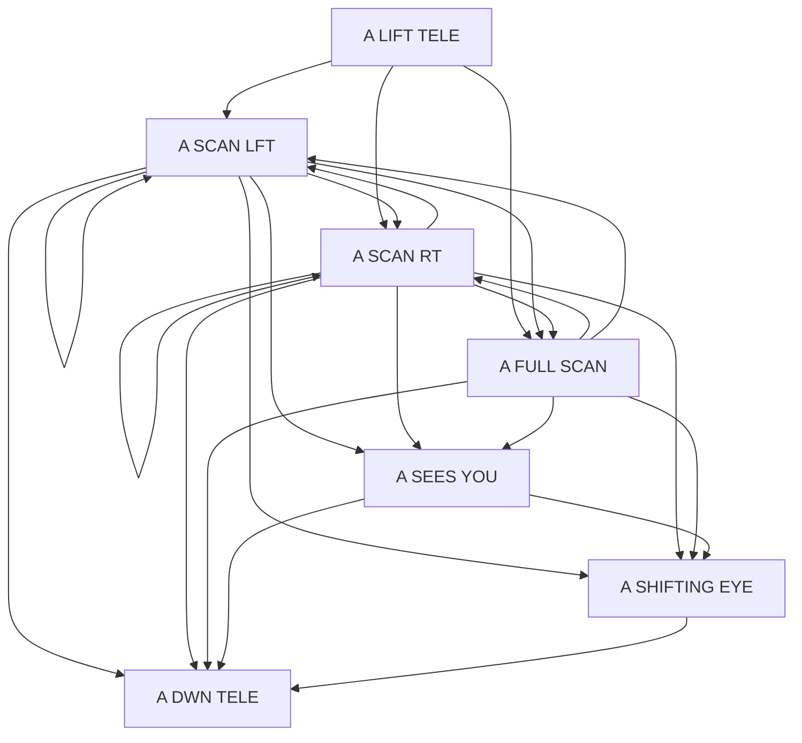
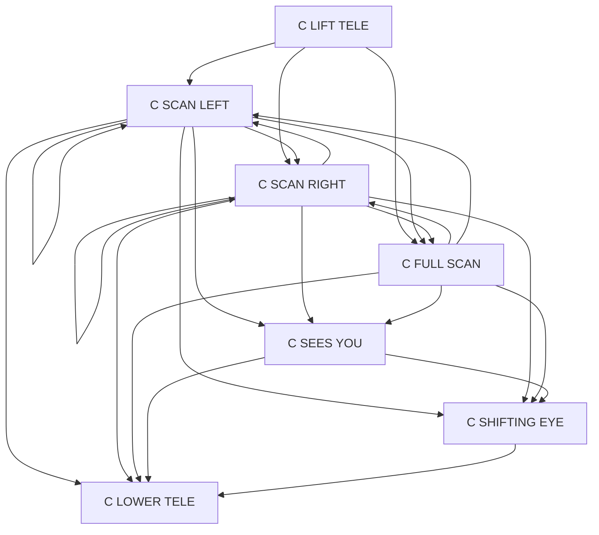

# STAND.ADS scene flows

Generated by `tools/faithfulness-oracle/scene-flow-doc.mjs` from the original ADS data — do not edit by hand; regenerate with `node tools/faithfulness-oracle/scene-flow-doc.mjs`.

A readable projection of each gag's authored ADS branch logic — guards, branches, and RANDOM picks — rendered through the SAME slot model the engine runs (`buildAdsSlots` in `src/dgds/scripting/ads-slots.mjs`), so a branch that is really a *fall-through* rung of a retry ladder reads as one ("otherwise…") rather than as a second independent start. It is faithful to the authored entry/fall-through structure; it is not a literal tick-by-tick trace (RANDOM picks and timing are decided at runtime). Pairs with [../story-over-time.md](../story-over-time.md), which covers the calendar-driven story arc across gags; this doc covers the scripted flow *within* each of this file's gags.

## MUN. AMB. POS.A  SW (`STAND.ADS` tag 1)

- **always** picks one of "sa amb hs sw", "sa amb ft sw", "sa amb st sw", "sa amb lk sw", "sa amb st sw", stop "sa amb st sw"

## MUN AMB POS.A W (`STAND.ADS` tag 2)

- **always** picks one of "sa amb sh w", "sa amb sb w", "sa amb ft w", "sa amb lk w", "sa amb st w", "sa amb st w", stop "sa amb st w"

## MUN AMB POS.A NW (`STAND.ADS` tag 3)

- **always** picks one of "sa amb hs nw", "sa amb bs nw", "SA AMB FT NW", "sa amb lk nw", "sa amb st nw", "sa amb st nw", stop "sa amb st nw"

## MUN AMB POS.B SW (`STAND.ADS` tag 4)

- **always** picks one of "sb amb hs sw", "sb amb ft sw", "sb amb st sw", "sb amb lk sw", "sb amb st sw", stop "sb amb st sw"

## MUN AMB POS.B S (`STAND.ADS` tag 5)

- **always** picks one of "sb amb hs s", "sb amb ft s", "sb amb lk s", "sb amb st s", "sb amb st s", stop "sb amb st s"

## MUN AMB POS.B SE (`STAND.ADS` tag 6)

- **always** picks one of "sb amb hs se", "sb amb ft se", "sb amb lk se", "sb amb st se", "sb amb st se", stop "sb amb st se"

## MUN AMB POS.C NE (`STAND.ADS` tag 7)

- **always** picks one of "sc amb hs ne", "sc amb bs ne", "sc amb ft ne", "sc amb lk ne", "sc amb st ne", "sc amb st ne", stop "sc amb st ne"

## MUN AMB POS.C E (`STAND.ADS` tag 8)

- **always** picks one of "sc amb hs e", "sc amb sb e", "sc amb ft e", "sc amb lk e", "sc amb st e", "sc amb st e", stop "sc amb st e"

## MUN AMB POS.D  NW (`STAND.ADS` tag 9)

- **always** picks one of "sd amb hs nw", "sd amb bs nw", "sd amb ft nw", "sd amb lk nw", "sd abm st nw", "sd abm st nw", stop "sd abm st nw"

## MUN AMB POS.D NE (`STAND.ADS` tag 10)

- **always** picks one of "sd amb hs ne", "sd amb bs ne", "sd amb ft ne", "sd amb lk ne", "sd amb st ne", "sd amb st ne", stop "sd amb st ne"

## MUN AMB POS.E NW (`STAND.ADS` tag 11)

- **always** picks one of "se amb hs nw", "se amb bs nw", "se amb ft nw", "se amb lk nw", "se amb st nw", "se amb st nw", stop "se amb st nw"

## MUN AMB POS.F NE (`STAND.ADS` tag 12)

- **always** picks one of "sf amb hs s", "sf amb ft s", "sf amb lk s", "sf amb st s", "sf amb st s", stop "sf amb st s"

## STAND INIT (`STAND.ADS` tag 14)

- **at the start** → "mundane amb. anima."

## TELESCOPE POS. A (`STAND.ADS` tag 15)

- **at the start** → "LOAD TELESCOPE", "A LIFT TELE"
- **after "A LIFT TELE"** picks one of "A SCAN LFT", "A SCAN RT", "A FULL SCAN"
- **after "A SCAN LFT"** picks one of "A SEES YOU", "A SHIFTING EYE", "A SCAN LFT", "A SCAN RT", "A FULL SCAN", "A DWN TELE"
- **after "A SCAN RT"** picks one of "A SEES YOU", "A SCAN LFT", "A SHIFTING EYE", "A SCAN RT", "A FULL SCAN", "A DWN TELE"
- **after "A FULL SCAN"** picks one of "A SEES YOU", "A SCAN RT", "A SCAN LFT", "A SHIFTING EYE", "A DWN TELE"
- **after "A SEES YOU"** picks one of "A SHIFTING EYE", "A DWN TELE"
- **after "A SHIFTING EYE"** → "A DWN TELE"

## TELESCOPE POS C (`STAND.ADS` tag 16)

- **at the start** → "LOAD TELESCOPE", "C LIFT TELE"
- **after "C LIFT TELE"** picks one of "C SCAN LEFT", "C SCAN RIGHT", "C FULL SCAN"
- **after "C SCAN LEFT"** picks one of "C SEES YOU", "C SCAN RIGHT", "C FULL SCAN", "C SCAN LEFT", "C SHIFTING EYE", "C LOWER TELE"
- **after "C SCAN RIGHT"** picks one of "C SEES YOU", "C FULL SCAN", "C SCAN RIGHT", "C SCAN LEFT", "C SHIFTING EYE", "C LOWER TELE"
- **after "C FULL SCAN"** picks one of "C SEES YOU", "C SCAN RIGHT", "C SCAN LEFT", "C SHIFTING EYE", "C LOWER TELE"
- **after "C SEES YOU"** picks one of "C SHIFTING EYE", "C LOWER TELE"
- **after "C SHIFTING EYE"** → "C LOWER TELE"

