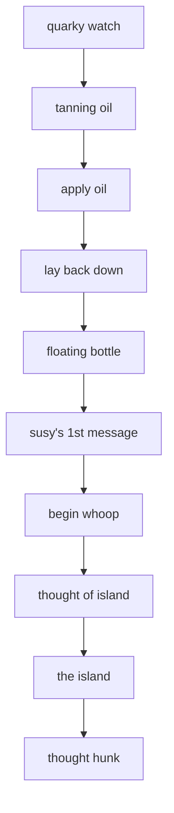
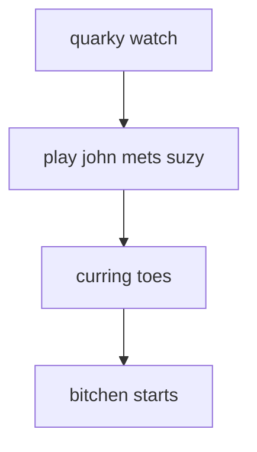

# SUZY.ADS scene flows

Generated by `tools/faithfulness-oracle/scene-flow-doc.mjs` from the original ADS data — do not edit by hand; regenerate with `node tools/faithfulness-oracle/scene-flow-doc.mjs`.

These diagrams come from the original game scripts and show how each gag can unfold. They include conditions, choices, and retry paths, but not exact timing or the result of a random choice. See [Johnny's 11-day story](../story-over-time.md) for how gags are chosen over time.

## SUZY CITY DWELLER (`SUZY.ADS` tag 1)

- **at the start** → "quarky watch", "load suzy city"
- **after "quarky watch"** → "tanning oil"
- **after "tanning oil"** → "apply oil"
- **after "apply oil"** → "lay back down"
- **after "lay back down"** → "floating bottle"
- **after "floating bottle"** → "susy's 1st message"
- **after "susy's 1st message"** → "begin whoop"
- **after "begin whoop"** → "thought of island"
- **after "thought of island"** → "the island"
- **after "the island"** → "thought hunk"

## JOHN MEETS SUZY (`SUZY.ADS` tag 2)

- **at the start** → "quarky watch", "load suzy mets john"
- **after "quarky watch"** → "play john mets suzy"
- **after "play john mets suzy"** → "curring toes"
- **after "curring toes"** → "bitchen starts"

