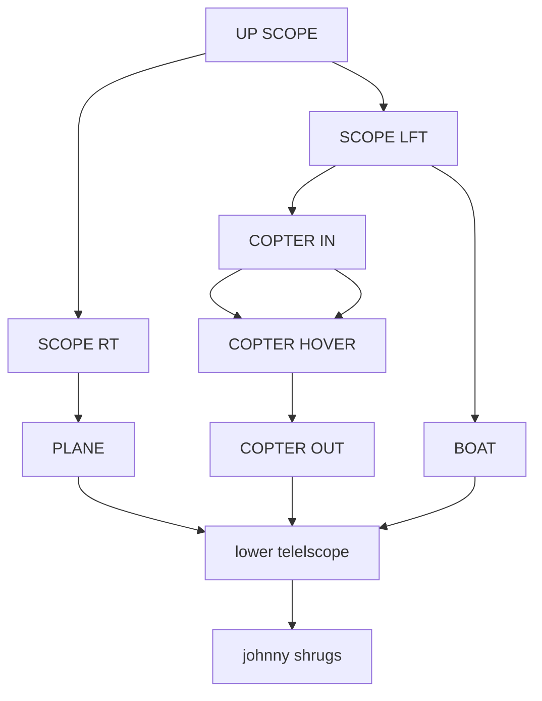
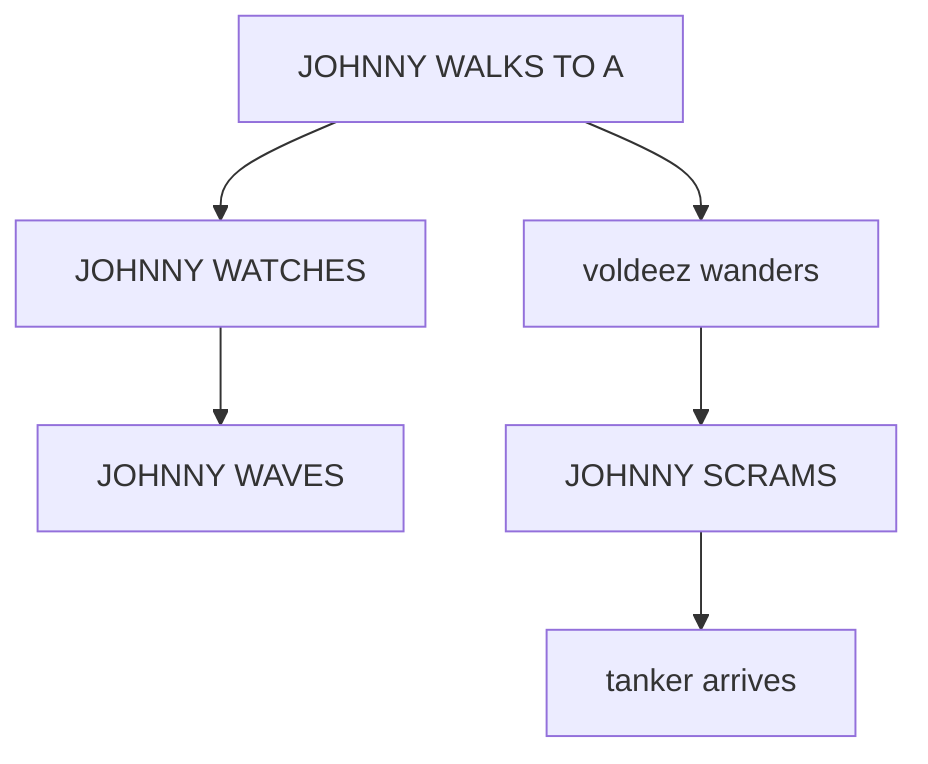
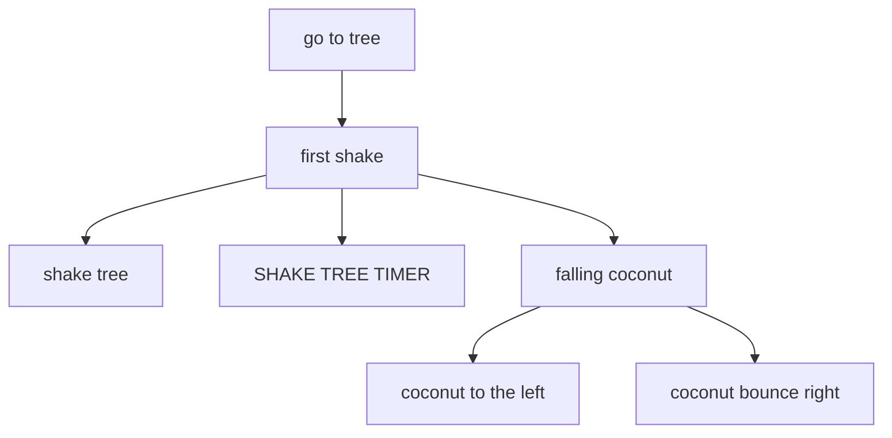
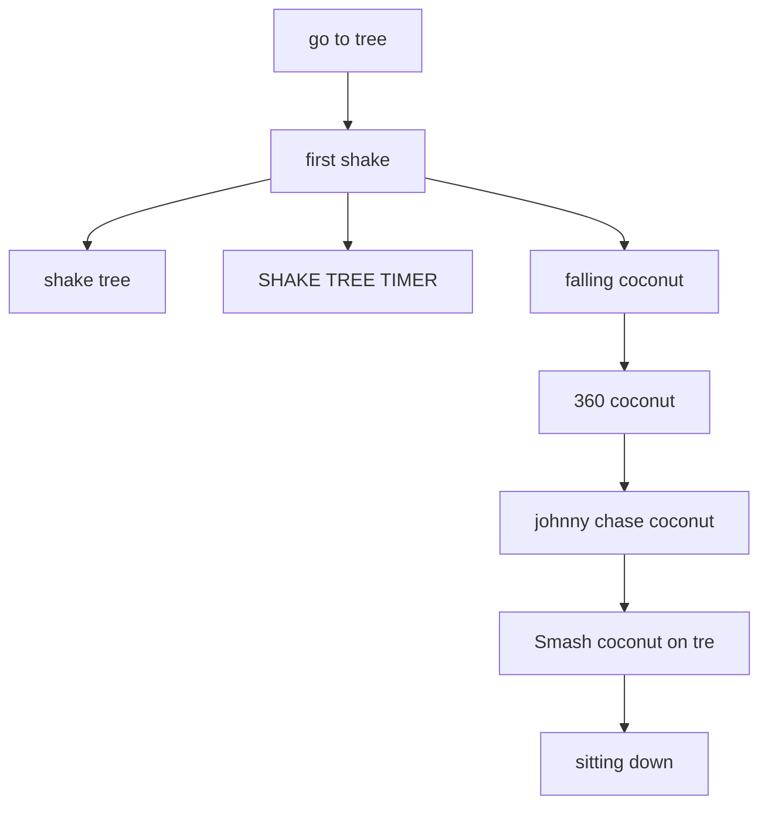
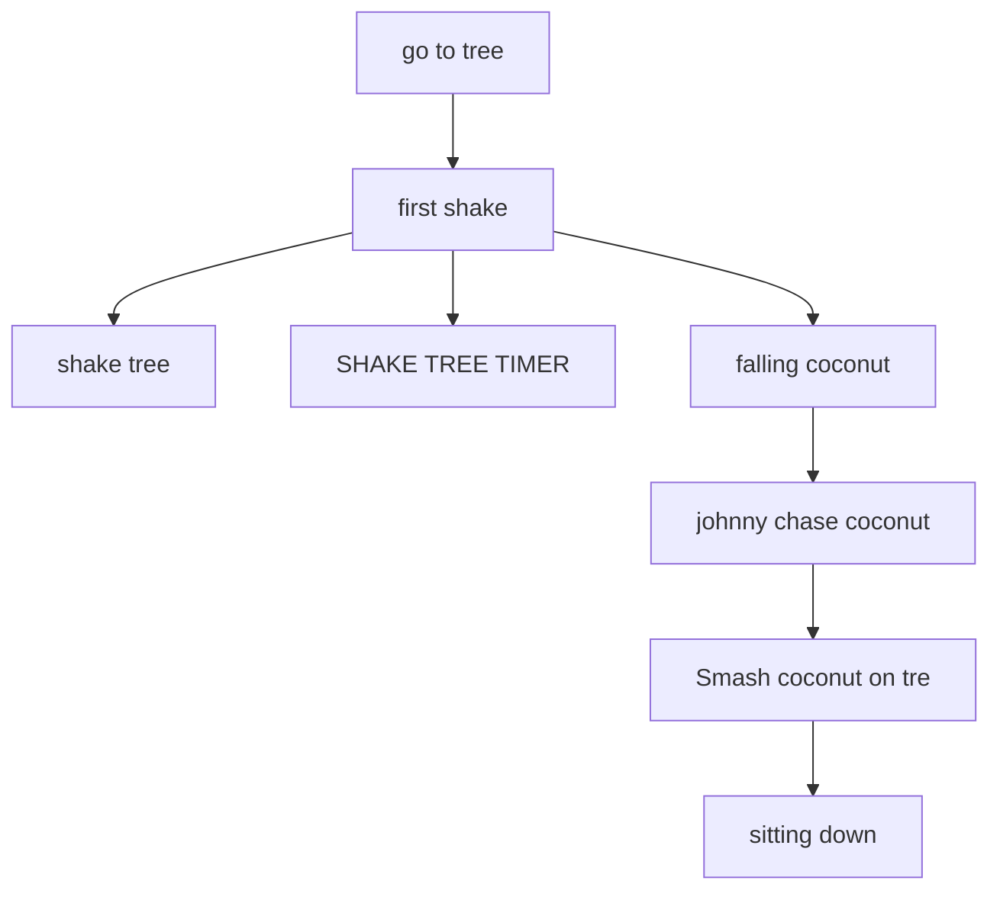
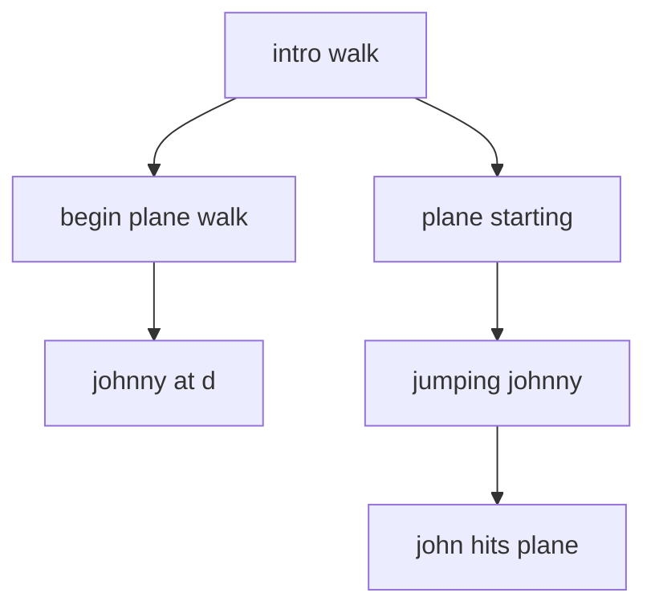

# VISITOR.ADS scene flows

Generated by `tools/faithfulness-oracle/scene-flow-doc.mjs` from the original ADS data — do not edit by hand; regenerate with `node tools/faithfulness-oracle/scene-flow-doc.mjs`.

These diagrams come from the original game scripts and show how each gag can unfold. They include conditions, choices, and retry paths, but not exact timing or the result of a random choice. See [Johnny's 11-day story](../story-over-time.md) for how gags are chosen over time.

## VISITOR 3 (`VISITOR.ADS` tag 1)

- **at the start** → "VISIT 3 LOAD", "UP SCOPE"
- **after "UP SCOPE"** picks one of "SCOPE RT", "SCOPE LFT"
- **after "SCOPE LFT"** picks one of "COPTER IN", "BOAT"
- **after "COPTER IN"** picks one of "COPTER HOVER", "COPTER HOVER"
- **after "COPTER HOVER"** → "COPTER OUT"
- **after "COPTER OUT"** → "lower telelscope"
- **after "SCOPE RT"** → "PLANE"
- **after "PLANE"** → "lower telelscope"
- **after "BOAT"** → "lower telelscope"
- **after "lower telelscope"** → "johnny shrugs"

## VISITOR 6 (`VISITOR.ADS` tag 3)

- **at the start** → "VISITOR 6 LOAD", "JOHNNY WALKS TO A"
- **after "JOHNNY WALKS TO A"** → "voldeez wanders", "JOHNNY WATCHES"
- **after "JOHNNY WATCHES"** → "JOHNNY WAVES"
- **after "voldeez wanders"** → "JOHNNY SCRAMS", stop "JOHNNY WAVES"
- **after "JOHNNY SCRAMS"** → "tanker arrives"

## COCONUT DROP L & R (`VISITOR.ADS` tag 4)

- **at the start** → "go to tree"
- **after "go to tree"** → "first shake"
- **after "first shake"** → "shake tree", "SHAKE TREE TIMER", "falling coconut"
- **after "falling coconut"** picks one of "coconut to the left", "coconut bounce right", stop "shake tree", stop "SHAKE TREE TIMER"

## COCONUT 360 (`VISITOR.ADS` tag 6)

- **at the start** → "go to tree"
- **after "go to tree"** → "first shake"
- **after "first shake"** → "shake tree", "SHAKE TREE TIMER", "falling coconut"
- **after "falling coconut"** → "360 coconut", stop "shake tree", stop "SHAKE TREE TIMER"
- **after "360 coconut"** → "johnny chase coconut"
- **after "johnny chase coconut"** → "Smash coconut on tre"
- **after "Smash coconut on tre"** → "sitting down"

## COCONUT CHASE (`VISITOR.ADS` tag 7)

- **at the start** → "go to tree"
- **after "go to tree"** → "first shake"
- **after "first shake"** → "shake tree", "SHAKE TREE TIMER", "falling coconut"
- **after "falling coconut"** → "johnny chase coconut", stop "shake tree", stop "SHAKE TREE TIMER"
- **after "johnny chase coconut"** → "Smash coconut on tre"
- **after "Smash coconut on tre"** → "sitting down"

## COCONUT VISITOR 5  (`VISITOR.ADS` tag 5)

- **at the start** → "load jvis5", "intro walk"
- **after "intro walk"** → "begin plane walk", "plane starting"
- **after "begin plane walk"** → "johnny at d"
- **after "plane starting"** → "jumping johnny", stop "johnny at d"
- **after "jumping johnny"** → "john hits plane"

