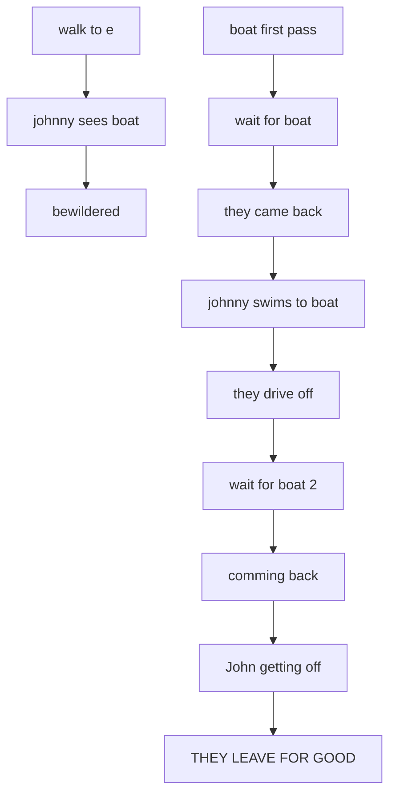
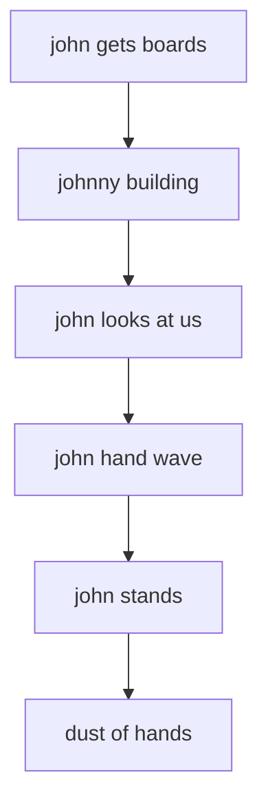
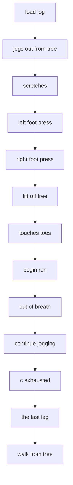

# WALKSTUF.ADS scene flows

Generated by `tools/faithfulness-oracle/scene-flow-doc.mjs` from the original ADS data — do not edit by hand; regenerate with `node tools/faithfulness-oracle/scene-flow-doc.mjs`.

A readable projection of each gag's authored ADS branch logic — guards, branches, and RANDOM picks — rendered through the SAME slot model the engine runs (`buildAdsSlots` in `src/dgds/scripting/ads-slots.mjs`), so a branch that is really a *fall-through* rung of a retry ladder reads as one ("otherwise…") rather than as a second independent start. It is faithful to the authored entry/fall-through structure; it is not a literal tick-by-tick trace (RANDOM picks and timing are decided at runtime). Pairs with [../story-over-time.md](../story-over-time.md), which covers the calendar-driven story arc across gags; this doc covers the scripted flow *within* each of this file's gags.

## WOULDBEAS (`WALKSTUF.ADS` tag 1)

- **at the start** → "load wouldbeas", "walk to e", "boat first pass"
- **after "walk to e"** → "johnny sees boat", stop "load wouldbeas"
- **after "johnny sees boat"** → "bewildered"
- **after "boat first pass"** → "wait for boat"
- **after "wait for boat"** → "they came back"
- **after "they came back"** → "johnny swims to boat", stop "bewildered"
- **after "johnny swims to boat"** → "they drive off"
- **after "they drive off"** → "wait for boat 2"
- **after "wait for boat 2"** → "comming back"
- **after "comming back"** → "John getting off"
- **after "John getting off"** → "THEY LEAVE FOR GOOD"

## MJ RAFT (`WALKSTUF.ADS` tag 2)

- **at the start** → "load raft", "john gets boards"
- **after "john gets boards"** → "johnny building"
- **after "johnny building"** → "john looks at us"
- **after "john looks at us"** → "john hand wave"
- **after "john hand wave"** → "john stands"
- **after "john stands"** → "dust of hands"

## JOG (`WALKSTUF.ADS` tag 3)

- **at the start** → "load jog"
- **after "load jog"** → "jogs out from tree"
- **after "jogs out from tree"** → "scretches"
- **after "scretches"** → "left foot press"
- **after "left foot press"** → "right foot press"
- **after "right foot press"** → "lift off tree"
- **after "lift off tree"** → "touches toes"
- **after "touches toes"** → "begin run"
- **after "begin run"** → "out of breath"
- **after "out of breath"** → "continue jogging"
- **after "continue jogging"** → "c exhausted"
- **after "c exhausted"** → "the last leg"
- **after "the last leg"** → "walk from tree"

